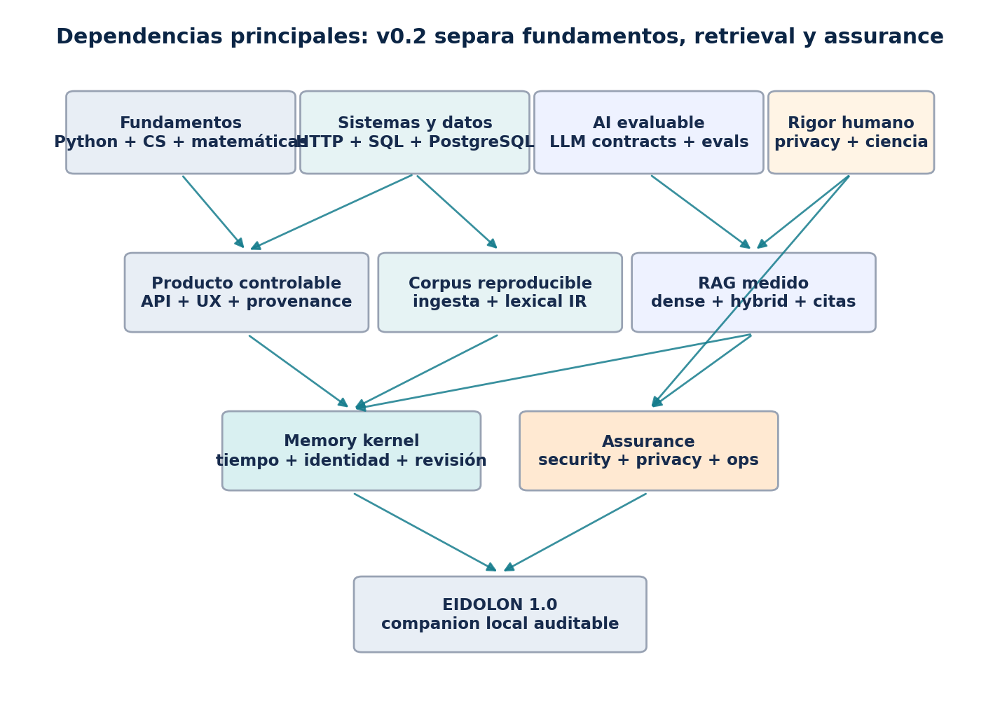

<!--
Document: Curriculum Blueprint
Canonical version: v0.2
Format migration: v0.3.0
Source: EIDOLON_CURRICULUM_BLUEPRINT_v0.2.docx
Status: active
Change policy: curricular decisions require an explicit ADR or a new Blueprint version.
-->

**EIDOLON**

**CURRICULUM BLUEPRINT**

Revisión externa y arquitectura curricular corregida

**Versión:** v0.2

**Estado:** Especificación curricular revisada; todavía no contiene los capítulos educativos completos

**Fecha de corte:** 25 de agosto de 2026

**Audiencia:** Luis Felipe Camacho Rojas (LuK), estudiante de Ingeniería en Sistemas Computacionales

**Método:** Revisión externa adversarial de v0.1 + contraste con estándares oficiales y literatura primaria

| **Dictamen:** v0.1 tenía una tesis arquitectónica correcta, pero no era todavía ejecutable como currículo definitivo: comprimía Computer Science, evaluación, seguridad, privacidad e ingesta, y exponía la capa psicológica antes de contar con suficiente disciplina de medición. v0.2 conserva el producto y corrige la secuencia. |
|---------------------------------------------------------------------------------------------------------------------------------------------------------------------------------------------------------------------------------------------------------------------------------------------------------------------------------------|

## Contrato del documento

Esta versión define la arquitectura curricular definitiva para redactar después los módulos educativos. Incluye el informe de revisión, las correcciones aceptadas, competencias con IDs, pesos, fases, gates y trazabilidad. No incluye todavía lecciones completas, lecturas comentadas, bancos de ejercicios ni exámenes finales.

## Contenido

- 1\. Dictamen externo de v0.1

- 2\. Decisiones canónicas de v0.2

- 3\. Arquitectura de competencias

- 4\. Mapa de dependencias y gates

- 5\. Matriz de prioridades

- 6\. Fases y versiones de EIDOLON

- 7\. Arquitectura objetivo

- 8\. Security y privacy

- 9\. Progresión de AI Engineering y evaluación

- 10\. Carta de rigor psicológico

- 11\. Matriz de trazabilidad

- 12\. Certificación y aprobación

- 13\. Investigación restante

- Apéndices: cambios y fuentes

## Convención terminológica

En la primera aparición se presenta una explicación en español y el término técnico habitual en inglés. Después se conserva la forma más natural de la documentación y el código.

| **Concepto**                                                                | **Uso en EIDOLON**                                               |
|-----------------------------------------------------------------------------|------------------------------------------------------------------|
| recuperación de información (Information Retrieval)                         | IR: encontrar y ordenar evidencia relevante.                     |
| generación aumentada por recuperación (Retrieval-Augmented Generation, RAG) | Generación condicionada por evidencia recuperada.                |
| búsqueda híbrida (hybrid retrieval)                                         | Combina señales léxicas y densas.                                |
| salida estructurada (structured output)                                     | Respuesta validable contra un schema.                            |
| evaluación comparativa (benchmark)                                          | Conjunto y protocolo estable para comparar sistemas.             |
| procedencia (provenance)                                                    | Origen, transformaciones y responsabilidad de un dato.           |
| ingesta de datos (data ingestion)                                           | Entrada, parsing, normalización y versionado del corpus.         |
| fragmentación (chunking)                                                    | División controlada de documentos para retrieval.                |
| reordenamiento (reranking)                                                  | Segundo ordenamiento de candidatos recuperados.                  |
| búsqueda aproximada de vecinos cercanos (Approximate Nearest Neighbor, ANN) | Índice vectorial que intercambia exactitud por costo o latencia. |
| banco de evaluación (eval harness)                                          | Código, datasets, métricas y reportes reproducibles.             |
| modelado de amenazas (threat modeling)                                      | Análisis sistemático de activos, actores, rutas y controles.     |
| privacidad desde el diseño (privacy by design)                              | Privacidad incorporada a arquitectura y ciclo de vida.           |
| cadena de suministro de software (software supply chain)                    | Dependencias, builds, modelos y artefactos de terceros.          |
| fuga entre particiones (data leakage)                                       | Información de prueba que contamina entrenamiento o diseño.      |
| juez basado en LLM (LLM-as-a-judge)                                         | Modelo usado como grader, sujeto a calibración humana.           |
| resolución de entidades (entity resolution)                                 | Decidir qué registros representan a la misma entidad.            |
| flujo durable (durable workflow)                                            | Proceso reanudable con estado y checkpoints persistentes.        |
| ajuste fino (fine-tuning)                                                   | Actualización de pesos para una tarea o dominio.                 |
| pruebas adversariales (red teaming)                                         | Búsqueda deliberada de fallas, abuso y rutas inseguras.          |

# 1. Dictamen externo de v0.1

La revisión se realizó como si v0.1 proviniera de otro equipo. El criterio no fue si el documento 'suena completo', sino si un estudiante puede seguirlo sin saltos ocultos y terminar con evidencia de que EIDOLON es correcto, seguro y científicamente defendible.

| **ID** | **Severidad** | **Hallazgo**                                             | **Riesgo**                                                                                                             | **Corrección v0.2**                                                                                   |
|--------|---------------|----------------------------------------------------------|------------------------------------------------------------------------------------------------------------------------|-------------------------------------------------------------------------------------------------------|
| F01    | ALTO          | No existe diagnóstico de entrada                         | P0 presupone Python introductorio y terminal; un alumno puede quedar bloqueado o repetir contenido.                    | Agregar P0 con diagnóstico, ruta puente y criterios de salida.                                        |
| F02    | CRÍTICO       | Computer Science está comprimido                         | D2 agrupa algoritmos, OS, redes, concurrencia y arquitectura con profundidad insuficiente.                             | Separar fundamentos algorítmicos de sistemas/redes y elevar prerequisitos por fase.                   |
| F03    | CRÍTICO       | P1 introduce abstracciones prematuras                    | Bitemporalidad, replay, hashing, schema evolution y Pydantic aparecen juntos antes de datos/serialización sólidos.     | Modelar primero con stdlib; mover persistencia temporal profunda a P2/P8 y Pydantic a bordes del API. |
| F04    | ALTO          | Faltan Unicode, tiempo y precisión                       | Son fuentes reales de corrupción en nombres, fechas, zonas horarias, scores y serialización.                           | Hacerlos gates de P0-P2.                                                                              |
| F05    | ALTO          | Falta una capa de ingesta                                | v0.1 salta de PostgreSQL a retrieval sin enseñar parsing, chunking, lineage, OCR/error y versionado de corpus.         | Crear un dominio y una fase de ingesta/corpus antes de dense retrieval.                               |
| F06    | CRÍTICO       | IR/RAG está sobrecomprimido                              | Un solo P5 mezcla BM25, embeddings, ANN, fusion, reranking y evaluación.                                               | Dividir lexical baseline (P6) de dense/hybrid RAG (P7); HNSW queda condicionado.                      |
| F07    | CRÍTICO       | Evals llegan demasiado tarde                             | La evaluación formal aparece en P8 aunque P4 ya usa LLMs.                                                              | Iniciar dataset, graders, baseline y error taxonomy en P5; P10 solo hace assurance.                   |
| F08    | CRÍTICO       | Security se enseña tarde                                 | Los checks tempranos no sustituyen conocimiento de AppSec, threat modeling, CORS/CSRF, SSRF y supply chain.            | Security-by-construction desde P0; ASVS/LLMSVS como evidencia acumulativa.                            |
| F09    | CRÍTICO       | Privacy no está operacionalizada                         | Faltan data inventory, propósito, minimización, consentimiento, terceros, egress y marco mexicano.                     | Separar D13, resolver políticas R0 e incorporar LFPDPPP/NIST Privacy Framework.                       |
| F10    | ALTO          | El perfil local se considera demasiado seguro            | Loopback no elimina riesgos de browser, procesos locales, backups, logs ni fallbacks remotos.                          | Threat model explícito y self-hosted remoto fuera de v1.0.                                            |
| F11    | CRÍTICO       | Psicología con rigor insuficiente                        | 110 h y una lista de teorías no bastan para measurement validity, causalidad, replicabilidad ni límites profesionales. | D14 completo antes de D15; carta de outputs prohibidos; revisión experta; feature opt-in y removible. |
| F12    | ALTO          | Frontend y HCI subestimados                              | React aparece como una fase compacta aunque corrección, delete y provenance requieren UX rigurosa.                     | Aumentar esfuerzo, accesibilidad WCAG y pruebas de usabilidad.                                        |
| F13    | MEDIO         | Docker aparece antes de una instalación nativa entendida | Puede esconder redes, procesos, filesystem y configuración.                                                            | Setup nativo primero; Compose opcional en P3 y obligatorio en P10.                                    |
| F14    | MEDIO         | Mem0/Letta ocupan espacio curricular                     | Son referencias de patrones, no prerequisitos ni contratos del producto.                                               | Moverlos a lecturas comparativas; no asignar mastery de framework.                                    |
| F15    | ALTO          | Horas optimistas                                         | Las rutas no cubren las brechas añadidas ni el nivel inicial real.                                                     | Reestimar por evidencia: 905/1,690/2,710 h; no usar horas como certificado.                           |
| F16    | MEDIO         | Redundancia en calidad                                   | Testing, AI eval, seguridad y certificación reaparecen con fronteras difusas.                                          | Definir cuatro planos: correctness, quality, risk y learner assessment.                               |

| **Conclusión del revisor:** No se recomienda redactar los capítulos completos desde v0.1. Sí se recomienda continuar desde v0.2 porque las fallas son de secuencia y especificación, no de la visión central del proyecto. |
|----------------------------------------------------------------------------------------------------------------------------------------------------------------------------------------------------------------------------|

## 1.1 Fortalezas preservadas

- Monolito modular antes de microservices.

- PostgreSQL como source of truth y embeddings como índices reconstruibles.

- Separación estricta de fuentes, claims, memorias e hipótesis.

- Baseline léxico antes de RAG avanzado.

- LangGraph, graph databases, fine-tuning y Kubernetes sujetos a triggers medidos.

- Corrección por supersession y borrado autorizado por encima de una inmutabilidad absoluta.

- Aprendizaje por vertical slices con gates y portfolio.

# 2. Decisiones canónicas de v0.2

v0.2 resuelve las preguntas R0 que v0.1 dejó abiertas. Estas decisiones son defaults de diseño y currículo; cambiarlas exige un Architecture Decision Record (ADR) y nuevas pruebas.

| **Tema**      | **Decisión**                                                                                                                                                                             | **Consecuencia**                                                                       |
|---------------|------------------------------------------------------------------------------------------------------------------------------------------------------------------------------------------|----------------------------------------------------------------------------------------|
| Producto v1.0 | Aplicación web local, single-user, enlazada a loopback. No desktop packaging ni self-hosted remoto en v1.0.                                                                              | Reduce auth/ops, pero conserva threat model de browser y procesos locales.             |
| Perfil remoto | Se mueve a EIDOLON 1.1.                                                                                                                                                                  | Requiere auth, HTTPS, rate limits, secrets, actualización e incident response propios. |
| Borrado       | Purge elimina payloads y derivados activos. Puede quedar solo un receipt/tombstone no sensible. Backups expiran por calendario documentado; no se promete borrado instantáneo imposible. | Resuelve provenance vs privacy con una promesa verificable.                            |
| Egress        | Local por default. Toda llamada remota requiere política por clase de dato, preview/redaction, consentimiento explícito y sin fallback silencioso.                                       | El runtime local no basta para afirmar local-first.                                    |
| Psicología    | Feature experimental, opt-in, no diagnóstica y removible. Prohibidos trait scores ocultos, predicción de terceros, crisis management y recomendaciones clínicas.                         | El disclaimer no compensa una capacidad insegura.                                      |
| Confianza     | Evidence grades cualitativos por default; probabilidades solo si existe calibración empírica para esa tarea.                                                                             | Evita pseudo-precisión.                                                                |
| Arquitectura  | Monolito modular; PostgreSQL + pgvector; model gateway neutral; jobs explícitos; React/TypeScript/Vite.                                                                                  | Mantiene bajo el costo cognitivo y operativo.                                          |
| Datos reales  | Solo después de privacy/security gates mínimos; corpus de desarrollo sintético o consentido.                                                                                             | Evita aprender mediante una filtración irreversible.                                   |

## 2.1 Definición de éxito

- El estudiante puede entrar por diagnóstico y no por una suposición vaga de nivel.

- Cada framework aparece después del concepto transferible que implementa.

- Cada fase produce código, pruebas, datos de evaluación, un ADR y evidencia de seguridad/privacy.

- Cada interpretación longitudinal puede auditarse, corregirse, abstenerse y dejar de influir tras un purge.

- EIDOLON 1.0 funciona sin LangGraph, microservices, Kubernetes, graph DB ni fine-tuning.

- La reflexión psicológica puede excluirse por completo sin romper el memory kernel.

# 3. Arquitectura de competencias

La revisión utiliza las áreas de Ciencias de la Computación (Computer Science) como control de cobertura, pero no intenta duplicar una licenciatura completa. Cada dominio incluye únicamente lo que EIDOLON necesita y declara su profundidad.

| **ID** | **Dominio**                            | **Alcance canónico**                                                             | **Peso** | **Profundidad**               |
|--------|----------------------------------------|----------------------------------------------------------------------------------|----------|-------------------------------|
| D1     | Programación e ingeniería de software  | Python, depuración, tipos, paquetes, Git, revisión, documentación                | 8%       | Profesional                   |
| D2     | Fundamentos algorítmicos y matemáticos | estructuras de datos, complejidad, lógica, conjuntos, grafos, máquinas de estado | 4%       | Aplicado                      |
| D3     | Sistemas, concurrencia y redes         | procesos, memoria, filesystem, async, DNS, TCP, TLS, HTTP                        | 5%       | Aplicado                      |
| D4     | Backend y APIs                         | contratos HTTP, FastAPI, Pydantic, arquitectura modular, jobs                    | 6%       | Profesional                   |
| D5     | Datos relacionales                     | SQL, PostgreSQL, restricciones, transacciones, índices, migraciones              | 8%       | Profesional                   |
| D6     | Frontend e interacción                 | HTML/CSS, JavaScript, TypeScript, React, accesibilidad y UX de control           | 5%       | Aplicado                      |
| D7     | Ingesta y gobierno de datos            | parsing, normalización, chunking, provenance, retención, exportación y evolución | 5%       | Profesional                   |
| D8     | Ingeniería de LLMs                     | inference, prompting, structured outputs, contratos, proveedores y Ollama        | 8%       | Profesional                   |
| D9     | Recuperación de información y RAG      | búsqueda léxica/densa, ranking, fusión, reranking, contexto y métricas           | 10%      | Profesional                   |
| D10    | Memoria temporal y de entidades        | eventos, claims, tiempo, identidad, relaciones, revisiones y consolidación       | 10%      | Profesional                   |
| D11    | Testing y evaluación de AI             | tests, datasets, splits, graders, incertidumbre, regresión y observabilidad      | 8%       | Profesional                   |
| D12    | Seguridad                              | threat modeling, AppSec, seguridad LLM, supply chain y verificación              | 6%       | Profesional                   |
| D13    | Privacidad y protección de datos       | privacy by design, consentimiento, egress, cifrado, borrado y backups            | 5%       | Profesional                   |
| D14    | Estadística y métodos de investigación | probabilidad, Bayes, medición, validez, causalidad y longitudinalidad            | 5%       | Aplicado                      |
| D15    | Psicología y reflexión responsable     | evidencia, límites de constructos, no diagnóstico, contraevidencia y abstención  | 4%       | Aplicado con alcance estricto |
| D16    | Producción y open source               | Docker, CI/CD, observabilidad, restore, licencias y releases                     | 3%       | Aplicado                      |
| D17    | Especializaciones post-v1.0            | LangGraph, distributed systems, graph DB, PyTorch y fine-tuning                  | 0%       | Opcional por trigger          |

| **Cambio de fondo:** D2 de v0.1 se divide. Algoritmos/matemáticas y sistemas/redes ya no quedan escondidos en un único dominio de 'working knowledge'. Ingesta y privacidad también se convierten en dominios propios. |
|------------------------------------------------------------------------------------------------------------------------------------------------------------------------------------------------------------------------|

## 3.1 Escala de dominio

| **Nivel**     | **Evidencia**                                             | **Uso**                                                              |
|---------------|-----------------------------------------------------------|----------------------------------------------------------------------|
| Fundacional   | Explica, traza ejemplos y completa tareas guiadas.        | No aprueba una release.                                              |
| Aplicado      | Implementa, depura casos comunes y explica tradeoffs.     | Suficiente para dominios de soporte.                                 |
| Profesional   | Diseña, prueba, migra, opera y rechaza usos inapropiados. | Obligatorio en backend, datos, IR, memory, eval, security y privacy. |
| Avanzado      | Optimiza bajo escala, fiabilidad u organización.          | Solo post-v1.0 o por bottleneck medido.                              |
| Investigación | Lee fuentes primarias, reproduce y critica incertidumbre. | Nunca bloquea el MVP salvo safety research de P9.                    |

## 3.2 Regla de espiral

- Security, privacy, testing y evals comienzan en P0 y acumulan evidencia; P10 hace assurance.

- SQL, tiempo, Unicode, concurrencia, retrieval e incertidumbre reaparecen con mayor profundidad.

- Cada tecnología tiene un exit strategy y una implementación conceptual independiente del framework.

- No se permite que un laboratorio de AI carezca de baseline, dataset o taxonomía de errores.

# 4. Mapa de dependencias y gates

El orden corregido evita dos atajos de v0.1: usar frameworks para ocultar fundamentos y usar LLMs antes de poder medir sus fallas.

Figura 1. Dependencias conceptuales de EIDOLON Curriculum Blueprint v0.2.

| **Gate**                       | **Evidencia requerida**                                                                      |
|--------------------------------|----------------------------------------------------------------------------------------------|
| Antes de P1                    | Python básico, tests, Git, Unicode, fechas y máquinas de estado simples.                     |
| Antes de ORM                   | SQL, joins, constraints y transacciones escritos a mano.                                     |
| Antes de async web             | Procesos, event loop, cancelación, timeouts y ownership de recursos.                         |
| Antes de React                 | HTML/CSS, JavaScript, browser events y HTTP.                                                 |
| Antes del primer LLM           | Task definition, baseline determinista, dataset pequeño, threat boundary y schema de salida. |
| Antes de dense retrieval       | Corpus reproducible, lexical baseline, relevance judgments y métricas.                       |
| Antes de ANN/HNSW              | Exact vector search medido y evidencia de que latencia/escala lo requieren.                  |
| Antes de memory extraction     | Provenance, corrections, human approval, purge propagation y identity policy.                |
| Antes de tools con efectos     | Authorization, allowlist, confirmation, idempotency, sandboxing y audit log.                 |
| Antes de reflexión psicológica | D14, safety charter, expert review, prohibited outputs y opt-in UX.                          |
| Antes de datos privados        | Data inventory, egress policy, redacted logs, export/purge y restore verificados.            |
| Antes de LangGraph/fine-tuning | Trigger medido, baseline fuerte, dataset propio y costo/beneficio documentado.               |

# 5. Matriz de prioridades

Las etiquetas se conservan en inglés porque funcionarán como vocabulario operativo estable: LEARN NOW, LEARN SOON, LEARN LATER, ONLY IF NEEDED y DO NOT PRIORITIZE.

| **Etiqueta**      | **Significado**                                                                     |
|-------------------|-------------------------------------------------------------------------------------|
| LEARN NOW         | P0-P2; desbloquea el resto.                                                         |
| LEARN SOON        | P3-P8; construye el producto útil.                                                  |
| LEARN LATER       | Después de un memory kernel medido.                                                 |
| ONLY IF NEEDED    | Solo tras un trigger de producto, calidad, escala u operación.                      |
| DO NOT PRIORITIZE | Bajo retorno para EIDOLON; no es una evaluación del valor general de la tecnología. |

| **Tecnología/conocimiento**                    | **Prioridad**     | **Primera fase**      | **Razón**                                              |
|------------------------------------------------|-------------------|-----------------------|--------------------------------------------------------|
| Python, pytest, Git/GitHub, Linux/Bash         | LEARN NOW         | P0                    | Base de implementación y evidencia.                    |
| Data structures, algorithms, discrete math     | LEARN NOW         | P0-P1                 | Invariantes, ranking, estados y complejidad.           |
| Unicode, fechas, zonas horarias, serialización | LEARN NOW         | P0-P2                 | Evitan corrupción silenciosa.                          |
| SQL y PostgreSQL                               | LEARN NOW         | P1-P2                 | Source of truth e invariantes.                         |
| Threat modeling y privacy by design            | LEARN NOW         | P0 onward             | No puede diferirse hasta el beta.                      |
| HTTP, TLS, DNS y async fundamentals            | LEARN SOON        | P3                    | Antes de FastAPI/SSE.                                  |
| SQLAlchemy 2 y Alembic                         | LEARN SOON        | P2                    | Después de SQL manual.                                 |
| FastAPI y Pydantic                             | LEARN SOON        | P3                    | Bordes de transporte, no modelo universal.             |
| JavaScript, TypeScript, React y Vite           | LEARN SOON        | P4                    | Shell auditable y UX de control.                       |
| WCAG 2.2 y usability testing                   | LEARN SOON        | P4-P11                | Accesibilidad y acciones destructivas seguras.         |
| Ollama y provider adapters                     | LEARN SOON        | P5                    | Runtime local detrás de contrato.                      |
| LLM evals y estadística aplicada               | LEARN SOON        | P5 onward             | Eval-driven development.                               |
| PostgreSQL FTS y lexical IR                    | LEARN SOON        | P6                    | Baseline antes de embeddings.                          |
| pgvector y hybrid retrieval                    | LEARN SOON        | P7                    | Después del corpus y benchmark léxico.                 |
| Hypothesis                                     | LEARN SOON        | P1-P8                 | Invariantes de estados, tiempo y migración.            |
| Docker/Compose                                 | LEARN SOON        | P3 opcional; P10      | Reproducibilidad después de setup nativo.              |
| LangGraph                                      | LEARN LATER       | 1.x                   | Solo para durable workflows demostrados.               |
| Mem0 y Letta                                   | LEARN LATER       | Lectura P8            | Comparar patrones, no adoptar contrato.                |
| Hugging Face y PyTorch                         | LEARN LATER       | 1.x                   | Custom models/rerankers después de baselines.          |
| Redis, Qdrant, Neo4j, OpenSearch               | ONLY IF NEEDED    | Trigger medido        | PostgreSQL primero.                                    |
| Celery/RabbitMQ                                | ONLY IF NEEDED    | Worker trigger        | Jobs simples o DB-backed primero.                      |
| WebSockets                                     | ONLY IF NEEDED    | Bidirectional trigger | SSE basta para streaming unidireccional.               |
| Next.js                                        | ONLY IF NEEDED    | Product trigger       | SSR/SEO no pertenece a v1.0.                           |
| Fine-tuning/LoRA                               | ONLY IF NEEDED    | 1.x                   | Task estable + dataset propio + baseline.              |
| LangChain                                      | DO NOT PRIORITIZE | Referencia            | Aprender contratos subyacentes; adapters pequeños.     |
| Kubernetes, Kafka, microservices               | DO NOT PRIORITIZE | Fuera de v1.0         | No existe escala ni equipo operativo.                  |
| TensorFlow                                     | DO NOT PRIORITIZE | Opcional              | PyTorch/Hugging Face es la rama prevista.              |
| Java, C++ y Rust                               | DO NOT PRIORITIZE | Fuera de EIDOLON      | Útiles académica/profesionalmente, no para este build. |

# 6. Fases de aprendizaje y versiones de EIDOLON

Las rutas mínima, recomendada y profunda suman aproximadamente 905, 1,690 y 2,710 horas. Son presupuestos de trabajo, no promesas. La ruta mínima no permite omitir gates: reduce lecturas y variantes, no seguridad ni evaluación.

| **ID** | **Foco**                                              | **Build**                                  | **Mín./rec./prof.** |
|--------|-------------------------------------------------------|--------------------------------------------|---------------------|
| P0     | Diagnóstico y puente de preparación                   | EIDOLON 0.0a - laboratorio reproducible    | 50 / 90 / 140 h     |
| P1     | Modelado epistemológico sin frameworks                | EIDOLON 0.1 - journal de provenance        | 60 / 110 / 180 h    |
| P2     | SQL, PostgreSQL y persistencia transaccional          | EIDOLON 0.2 - núcleo de datos              | 80 / 150 / 230 h    |
| P3     | HTTP, backend y límites de confianza                  | EIDOLON 0.3 - data service                 | 70 / 130 / 210 h    |
| P4     | Frontend, accesibilidad y UX de control               | EIDOLON 0.4 - companion shell              | 70 / 130 / 200 h    |
| P5     | LLM engineering guiado por evaluación                 | EIDOLON 0.5 - model gateway evaluado       | 75 / 140 / 220 h    |
| P6     | Ingesta, corpus y recuperación léxica                 | EIDOLON 0.6 - evidence search              | 60 / 110 / 180 h    |
| P7     | Embeddings, búsqueda híbrida y RAG                    | EIDOLON 0.7 - RAG híbrido                  | 70 / 130 / 210 h    |
| P8     | Memoria autobiográfica, temporal y relacional         | EIDOLON 0.8 - memory kernel                | 90 / 170 / 270 h    |
| P9     | Método científico y reflexión psicológica restringida | EIDOLON 0.9a - reflection research preview | 90 / 180 / 300 h    |
| P10    | Security, privacy y production assurance              | EIDOLON 0.9b - private release candidate   | 90 / 170 / 270 h    |
| P11    | Capstone integrado y defensa profesional              | EIDOLON 1.0 - companion auditable local    | 100 / 190 / 300 h   |

| **Cambio de progresión:** v0.2 separa lexical IR de dense/hybrid RAG, añade ingesta/corpus y mueve assurance al final sin mover la enseñanza de security/privacy al final. |
|----------------------------------------------------------------------------------------------------------------------------------------------------------------------------|

## P0 - Diagnóstico y puente de preparación

**Build.** EIDOLON 0.0a - laboratorio reproducible

**Esfuerzo.** 50 / 90 / 140 h

**Prerrequisitos.** Ninguno; diagnóstico inicial obligatorio.

**Objetivo.** Cerrar brechas mínimas sin convertir todo Computer Science en una fase previa interminable.

**Teoría.** control de flujo, funciones, colecciones, excepciones, archivos, Git, terminal, debugging, complejidad básica, Unicode, fechas y zonas horarias

**Práctica.** Python estándar, pytest, logging, pyproject.toml, ramas, code review, README y ADR

**Laboratorios representativos.** parser de diario con Unicode; pruebas de fechas; stack/queue/hash map; revert de Git; secret scan

**Integración EIDOLON.** CLI determinista que registra y filtra eventos sintéticos; sin LLM, Pydantic, Docker ni base de datos.

**Gate de aprobación.** Implementa desde una especificación pequeña, explica complejidad, depura con evidencia y pasa pruebas de Unicode/tiempo.

## P1 - Modelado epistemológico sin frameworks

**Build.** EIDOLON 0.1 - journal de provenance

**Esfuerzo.** 60 / 110 / 180 h

**Prerrequisitos.** P0; lógica proposicional, conjuntos y máquinas de estado básicas.

**Objetivo.** Separar source, observation, claim, inference, hypothesis y correction antes de automatizar nada.

**Teoría.** identidad, invariantes, serialización, hashing con límites, valid time vs recorded time, estados y evolución de esquemas

**Práctica.** dataclasses/stdlib primero; JSONL versionado; funciones puras de proyección; property tests introductorios

**Laboratorios representativos.** rechazar transiciones inválidas; corregir sin reescribir fuente; replay; purge sintético; migrar formato v1 a v2

**Integración EIDOLON.** Journal local auditable con export, correction, supersession y deletion receipt.

**Gate de aprobación.** Toda salida identifica su fuente o su carácter derivado; replay y borrado son reproducibles.

## P2 - SQL, PostgreSQL y persistencia transaccional

**Build.** EIDOLON 0.2 - núcleo de datos

**Esfuerzo.** 80 / 150 / 230 h

**Prerrequisitos.** P1; álgebra relacional informal y SQL básico antes del ORM.

**Objetivo.** Convertir invariantes del dominio en restricciones y transacciones reales.

**Teoría.** modelado relacional, normalización, PK/FK, constraints, MVCC, isolation, locks, B-tree/GIN, EXPLAIN, migrations y backups

**Práctica.** PostgreSQL, SQL directo, SQLAlchemy 2 y Alembic después de dominar consultas; integration tests reales

**Laboratorios representativos.** rollback forzado; race condition; plan indexado; migración con datos; backup/restore; eliminación propagada

**Integración EIDOLON.** Persistencia PostgreSQL del journal; todavía sin API pública ni Docker obligatorio.

**Gate de aprobación.** Diseña el schema, prueba transaction boundaries, interpreta EXPLAIN y restaura una base migrada.

## P3 - HTTP, backend y límites de confianza

**Build.** EIDOLON 0.3 - data service

**Esfuerzo.** 70 / 130 / 210 h

**Prerrequisitos.** P2; procesos, sockets, DNS, TCP, TLS y HTTP a nivel práctico.

**Objetivo.** Exponer casos de uso mediante contratos estables sin confundir transporte, dominio y persistencia.

**Teoría.** HTTP semantics, REST, OpenAPI, auth boundary, CORS/CSRF, sync vs async, cancelación, idempotencia y errores

**Práctica.** FastAPI y Pydantic en bordes; service layer; tests de contrato; rate/size limits; setup nativo documentado

**Laboratorios representativos.** validación hostil; timeout/cancel; doble submit idempotente; CORS incorrecto; error de autorización

**Integración EIDOLON.** API local para sources, events, claims, corrections, export y purge; bind a loopback.

**Gate de aprobación.** El API conserva invariantes bajo errores, concurrencia y entradas no confiables; threat model v1 aprobado.

## P4 - Frontend, accesibilidad y UX de control

**Build.** EIDOLON 0.4 - companion shell

**Esfuerzo.** 70 / 130 / 200 h

**Prerrequisitos.** P3; HTML/CSS y JavaScript antes de React.

**Objetivo.** Construir una interfaz donde provenance, incertidumbre, corrección y borrado sean visibles.

**Teoría.** browser runtime, TypeScript, estado cliente/servidor, accesibilidad, threat-aware UX y optimistic vs confirmed state

**Práctica.** React + TypeScript + Vite; keyboard navigation; component/e2e tests; errores y estados vacíos

**Laboratorios representativos.** timeline accesible; drawer de provenance; preview de purge; recovery tras fallo; auditoría WCAG 2.2

**Integración EIDOLON.** Shell sin inteligencia: historial, timeline, revisión, export y purge sobre datos sintéticos.

**Gate de aprobación.** Una persona puede inspeccionar y revertir acciones; las operaciones destructivas no dependen de dark patterns.

## P5 - LLM engineering guiado por evaluación

**Build.** EIDOLON 0.5 - model gateway evaluado

**Esfuerzo.** 75 / 140 / 220 h

**Prerrequisitos.** P3-P4; probabilidad, muestreo y diseño de experimento básicos.

**Objetivo.** Agregar modelos como componente no confiable detrás de contratos y un eval harness desde el primer día.

**Teoría.** tokens, context windows, transformers conceptuales, inference, sampling, quantization, prompting, structured output, grounding y model drift

**Práctica.** Ollama y adapter neutral; schema validation; retries acotados; timeout; versionado; dataset/graders antes de optimizar prompts

**Laboratorios representativos.** salida inválida; cambio de proveedor; truncamiento; repetición estocástica; prompt injection sin tools con efectos

**Integración EIDOLON.** Chat con metadata de modelo, citas a contexto explícito y cero escrituras autónomas de memoria.

**Gate de aprobación.** Los cambios de prompt/modelo se comparan contra un baseline con intervalos o variabilidad reportada.

## P6 - Ingesta, corpus y recuperación léxica

**Build.** EIDOLON 0.6 - evidence search

**Esfuerzo.** 60 / 110 / 180 h

**Prerrequisitos.** P2 y P5; normalización textual, precisión/recall y muestreo de juicios.

**Objetivo.** Construir primero un corpus reproducible y una búsqueda léxica medible.

**Teoría.** parsing, chunking, lineage, inverted index, TF-IDF/BM25, analyzers, metadata, leakage y relevance judgments

**Práctica.** PostgreSQL Full Text Search; dataset mexicano-español/code-switching; trazas de ingestión y recuperación

**Laboratorios representativos.** comparar chunks; errores de OCR/Unicode; lexical baseline; hard negatives; consultas temporales y por entidad

**Integración EIDOLON.** Panel de búsqueda de evidencia con provenance completa; todavía sin pgvector obligatorio.

**Gate de aprobación.** Corpus, splits, etiquetas y baseline son versionados; errores de ingestión y retrieval se distinguen.

## P7 - Embeddings, búsqueda híbrida y RAG

**Build.** EIDOLON 0.7 - RAG híbrido

**Esfuerzo.** 70 / 130 / 210 h

**Prerrequisitos.** P6; vectores, producto punto, coseno y métricas de ranking.

**Objetivo.** Añadir recuperación densa únicamente contra el baseline léxico existente.

**Teoría.** embeddings, exact search, ANN, HNSW, filtros, Reciprocal Rank Fusion, reranking, context assembly y grounded generation

**Práctica.** pgvector exacto primero; HNSW condicionado; fusion; citas; evaluación separada de retrieval y generation

**Laboratorios representativos.** exact vs ANN; filtro selectivo; sparse+dense; cambio de embedding; respuesta con evidencia insuficiente

**Integración EIDOLON.** RAG con retrieval debug, citas verificables y abstention; ninguna memoria se escribe en secreto.

**Gate de aprobación.** La búsqueda híbrida mejora casos definidos sin degradar seguridad, latencia ni consultas léxicas difíciles.

## P8 - Memoria autobiográfica, temporal y relacional

**Build.** EIDOLON 0.8 - memory kernel

**Esfuerzo.** 90 / 170 / 270 h

**Prerrequisitos.** P1-P3 y P6-P7; bitemporalidad, entity resolution y jobs idempotentes.

**Objetivo.** Construir memoria longitudinal que preserve contradicciones, tiempo, identidad y consentimiento.

**Teoría.** episodic/semantic memory como categorías de ingeniería, entity resolution, bitemporal models, consolidation y conflict policies

**Práctica.** memory candidates con aprobación humana; evidence edges; relación versionada; replay; re-embedding; deletion propagation

**Laboratorios representativos.** homónimos; alias ambiguos; 'qué se creía cuándo'; contradicción; corrección; poisoning; LongMemEval/LoCoMo crítico

**Integración EIDOLON.** Timeline, personas, relaciones y memorias aceptadas/rechazadas con provenance completa.

**Gate de aprobación.** Pasan benchmarks propios de identidad, temporalidad, actualización, abstention y borrado.

## P9 - Método científico y reflexión psicológica restringida

**Build.** EIDOLON 0.9a - reflection research preview

**Esfuerzo.** 90 / 180 / 300 h

**Prerrequisitos.** P8; D14 completo; safety charter aprobado y revisión experta externa.

**Objetivo.** Probar una capa de reflexión falsable sin convertir conversación en evaluación psicológica.

**Teoría.** validez/reliabilidad, construct validity, base rates, confounders, causalidad, effect sizes, replicabilidad y límites de teorías

**Práctica.** hipótesis rivales, evidence/counterevidence, lenguaje calibrado, user rejection, abstention y prohibited-output tests

**Laboratorios representativos.** observación vs inferencia; alternativas; sparse-data refusal; trait-score refusal; sesgo de confirmación; third-party boundary

**Integración EIDOLON.** Vista experimental opt-in; no se activa por defecto ni se promueve una hipótesis a hecho.

**Gate de aprobación.** Evaluadores humanos calificados aprueban rúbricas y red-team cases; si no, la función queda fuera de v1.0.

## P10 - Security, privacy y production assurance

**Build.** EIDOLON 0.9b - private release candidate

**Esfuerzo.** 90 / 170 / 270 h

**Prerrequisitos.** P0-P9; controles incrementales ya implantados.

**Objetivo.** Convertir controles tempranos en evidencia verificable de release, no introducir seguridad al final.

**Teoría.** ASVS, LLMSVS, NIST SSDF, privacy risk, LFPDPPP, key management, secure deletion limits, SLOs y incident response

**Práctica.** Docker/Compose, CI/CD, SBOM, dependency/model provenance, redacted telemetry, encrypted backup, restore y upgrade drills

**Laboratorios representativos.** indirect prompt injection; malicious document; SSRF; leaked secret; poisoned embedding; backup expiry; clean-machine install

**Integración EIDOLON.** Perfil personal local endurecido; el perfil remoto self-hosted se difiere a 1.1.

**Gate de aprobación.** Cada riesgo crítico tiene owner, control, test y evidencia; purge/backups/egress coinciden con la política declarada.

## P11 - Capstone integrado y defensa profesional

**Build.** EIDOLON 1.0 - companion auditable local

**Esfuerzo.** 100 / 190 / 300 h

**Prerrequisitos.** Todos los gates P0-P10; P9 puede quedar desactivado si no supera su gate.

**Objetivo.** Integrar, medir, documentar y defender el sistema completo ante revisión independiente.

**Teoría.** tradeoffs, failure budgets, eval interpretation, migration strategy, limitations y roadmap economics

**Práctica.** build completo, benchmark final, usability study, security review, restore, model swap, embedding migration y defensa

**Laboratorios representativos.** disaster scenario; adversarial update; longitudinal replay; provider failure; deletion audit; reproducibility review

**Integración EIDOLON.** Producto local single-user con chat, memory kernel, retrieval híbrido, controles de datos y documentación; reflexión solo si fue aprobada.

**Gate de aprobación.** Un revisor reproduce resultados e instalación; el autor explica, prueba, critica y mantiene cada componente central.

# 7. Arquitectura objetivo de EIDOLON 1.0

| **Capa**      | **Default**                            | **Responsabilidad**                                                              |
|---------------|----------------------------------------|----------------------------------------------------------------------------------|
| Cliente       | React + TypeScript + Vite              | Chat, timeline, provenance, corrección, export/purge, settings y accesibilidad.  |
| API           | FastAPI + Pydantic                     | Validación de transporte, casos de uso, límites de confianza y SSE.              |
| Dominio       | Plain Python                           | Events, claims, memory candidates, evidence, hypotheses, corrections y policies. |
| Persistencia  | PostgreSQL + SQLAlchemy/Alembic        | Registros canónicos, constraints, transacciones, temporalidad y migrations.      |
| Ingesta       | Jobs explícitos                        | Parsing, normalización, chunking, lineage, backfills y quarantine.               |
| Retrieval     | PostgreSQL FTS + pgvector              | Lexical/dense candidates, filtros, fusion, optional rerank y trazas.             |
| Model gateway | Ollama default + APIs opcionales       | Capabilities, structured outputs, privacy policy, timeout y version logging.     |
| Workflows     | State machines/jobs; LangGraph después | Aprobación humana, retries, idempotencia y resumibilidad cuando se justifique.   |
| Quality       | pytest + Hypothesis + eval harness     | Correctness, retrieval, memory, generation, safety y privacy por separado.       |
| Ops           | Docker/Compose + CI                    | Reproducibilidad, observabilidad redactada, backup/restore y releases.           |

## 7.1 Objetos e invariantes

| **Objeto**              | **Significado**                                 | **Invariante**                                                           |
|-------------------------|-------------------------------------------------|--------------------------------------------------------------------------|
| SourceRecord            | Payload original y metadata                     | Se conserva durante retención; purge explícito elimina contenido.        |
| Event                   | Acontecimiento afirmado con valid/recorded time | Append-only durante retención; puede ser superseded.                     |
| Claim                   | Proposición atómica atribuible                  | Subject/predicate/value, source, time, status y confidence semantics.    |
| Entity/Person           | Ancla de identidad y aliases                    | Merge reversible; nombre igual no basta.                                 |
| RelationshipState       | Relación versionada                             | Temporal y evidence-backed; no perfil plano mutable.                     |
| MemoryCandidate         | Representación derivada propuesta               | No influye persistentemente sin policy/approval.                         |
| Memory                  | Representación derivada aceptada                | Versionada, reconstruible y nunca source fact.                           |
| Hypothesis              | Interpretación tentativa                        | Alternativas, support/refute evidence, uncertainty y lifecycle.          |
| EvidenceEdge            | Vínculo tipado                                  | Registra provenance y transformation version.                            |
| Correction/PurgeReceipt | Cambio de estado o eliminación                  | Actualiza proyecciones; purge reporta completion/error y backup horizon. |

## 7.2 Perfil de deployment

| **EIDOLON 1.0:** Aplicación web local single-user, bind a loopback, PostgreSQL y Ollama locales, sin telemetry remota por default. EIDOLON 1.1 podrá añadir self-hosting remoto después de una revisión separada de auth, network y operations. |
|-------------------------------------------------------------------------------------------------------------------------------------------------------------------------------------------------------------------------------------------------|

# 8. Security y privacy: corrección transversal

Seguridad y privacidad no son sinónimos. Security protege propiedades del sistema; privacy gestiona los problemas que el procesamiento puede causar a las personas. v0.2 los separa y exige evidencia desde P0.

| **Momento** | **Controles**                                                                                | **Evidencia**                           |
|-------------|----------------------------------------------------------------------------------------------|-----------------------------------------|
| P0-P1       | Secret hygiene, dependency pinning, synthetic data, data classification, basic threat model. | No secrets en repo; fixtures no reales. |
| P2          | Least-privilege DB user, migrations revisadas, backup/restore, purge propagation.            | Restore y delete tests.                 |
| P3-P4       | Host validation, CORS/CSRF, input limits, auth boundary, destructive UX y accessibility.     | ASVS subset + e2e abuse cases.          |
| P5          | No-trust model boundary, schema validation, egress deny-by-default, no side-effect tools.    | Prompt/model contract tests.            |
| P6-P8       | Malicious documents, corpus poisoning, provenance, embedding namespace, identity isolation.  | Retrieval/memory red team.              |
| P9          | Sensitive inference minimization, third-party boundaries, prohibited psychological outputs.  | Expert safety review.                   |
| P10-P11     | ASVS/LLMSVS mapping, SBOM, model provenance, encrypted backups, incident/restore drills.     | Release evidence bundle.                |

## 8.1 Política de datos mínima

- Inventario de categorías: autobiográficos, credenciales, terceros, salud/sensibles, telemetry y derivados.

- Finalidad y retención explícitas por categoría; minimización antes de cifrado.

- Consentimiento granular para remote APIs; preview y redaction antes del envío.

- Derechos de acceso, rectificación, cancelación y oposición (ARCO) estudiados para el contexto mexicano; revisión jurídica antes de distribución pública.

- No entrenar modelos ni crear eval datasets con datos reales sin consentimiento separado y provenance.

- Logs, traces, caches, embeddings y backups forman parte del alcance de purge.

- Las limitaciones de secure deletion en backups, filesystem y proveedores se documentan; nunca se promete lo que no puede verificarse.

# 9. Progresión de AI Engineering y evaluación

La progresión corregida es tarea -\> baseline -\> dataset -\> contrato de modelo -\> experimentos -\> retrieval -\> memory -\> safety. 'Hacer prompting' sin esa cadena no cuenta como ingeniería.

| **Paso**              | **Requisito**                                                                            | **Artefacto**              |
|-----------------------|------------------------------------------------------------------------------------------|----------------------------|
| 1\. Tarea             | Definir input, output, errores, abstention y costo de fallo.                             | Spec + ejemplos negativos. |
| 2\. Baseline          | Regla determinista o búsqueda léxica antes de un LLM/RAG complejo.                       | Métricas iniciales.        |
| 3\. Dataset           | Casos representativos, hard negatives, splits y leakage review.                          | Dataset versionado.        |
| 4\. Contrato          | Provider-neutral I/O, structured output, timeout, retries y refusal.                     | Contract tests.            |
| 5\. Experimento       | Comparar prompt/modelo con repetición y variabilidad.                                    | Run manifest.              |
| 6\. Component eval    | Separar ingestión, retrieval, context y generation.                                      | Error attribution.         |
| 7\. Memory eval       | Tiempo, identidad, updates, contradictions, correction y deletion.                       | Longitudinal suite.        |
| 8\. Human/safety eval | Rúbricas humanas, inter-rater agreement, LLM judge calibrado y red team.                 | Safety case.               |
| 9\. Production loop   | Drift, regresiones, incidentes y nuevos casos sin capturar datos privados indebidamente. | Release dashboard.         |

## 9.1 Planos de calidad

| **Plano**   | **Qué mide**                                                                       | **Evidencia**                                               |
|-------------|------------------------------------------------------------------------------------|-------------------------------------------------------------|
| Correctness | Código, schema, migrations, replay, idempotency, purge.                            | pytest/Hypothesis/integration/e2e.                          |
| Retrieval   | Recall@K, MRR, nDCG, latency, filters, no-result behavior.                         | Relevance judgments y bootstrap/intervals cuando aplique.   |
| Generation  | Faithfulness, citation correctness, relevance, uncertainty y refusal.              | Checks deterministas + humanos; judge calibrado.            |
| Memory      | Temporalidad, identidad, update, contradiction, correction, abstention y deletion. | Benchmark propio + tareas inspiradas en LongMemEval/LoCoMo. |
| Risk        | Prompt injection, poisoning, egress, privacy harm, dependency/model compromise.    | Threat scenarios y release gates.                           |
| Learner     | Explicar, implementar, probar, integrar, evaluar, criticar y enseñar.              | Examen práctico + defensa.                                  |

| **Corrección importante:** Un LLM-as-a-judge no se acepta como autoridad. Primero se define una rúbrica y un conjunto humano; después se mide consistencia, alineación, sesgo y sobreconfianza del judge. Se reporta incertidumbre, no solo un promedio. |
|----------------------------------------------------------------------------------------------------------------------------------------------------------------------------------------------------------------------------------------------------------|

# 10. Carta de rigor psicológico

La capa psicológica se redefine como apoyo a la reflexión, no como evaluación psicológica. El sistema trabaja con observaciones que el usuario puede inspeccionar y con hipótesis rivales; no asigna identidades clínicas ni convierte teorías en hechos.

## 10.1 Contenido obligatorio antes de implementar

- Jerarquía de evidencia, systematic reviews, effect sizes, risk of bias y replicabilidad.

- Reliability, validity, construct validity, measurement invariance y límites de generalización.

- Base rates, confounders, correlación vs causalidad, longitudinal inference y regression to the mean.

- Diferencia entre instrumento validado, conversación informal, self-report y comportamiento observado.

- Límites culturales y lingüísticos; no extrapolar normas de otra población a español mexicano.

- Licencias y administración de instrumentos: no implementar test psicológico por parecer útil.

- Dependence, anthropomorphism, persuasive authority, crisis boundaries y third-party consent.

## 10.2 Outputs permitidos y prohibidos

| **Clase**              | **Regla**                                                                                                                                                                 |
|------------------------|---------------------------------------------------------------------------------------------------------------------------------------------------------------------------|
| Permitido              | Resumir observaciones citadas; preguntar; proponer varias explicaciones; señalar contraevidencia; recomendar revisar la interpretación.                                   |
| Condicional            | Usar vocabulario de una teoría como lente educativa, con evidence grade y límites explícitos.                                                                             |
| Prohibido              | Diagnóstico, risk score clínico, attachment/personality score oculto, certeza numérica no calibrada, predicción de conducta de terceros, crisis management o tratamiento. |
| Abstention obligatoria | Datos escasos, fuentes contradictorias sin resolución, solicitud clínica, datos de un tercero sin consentimiento o inferencia que excede el evidence map.                 |

## 10.3 Gate de publicación

P9 no aprueba por tener una demo. Requiere safety charter, evidence map, rúbricas, red-team cases y revisión por al menos una persona con formación relevante en métodos/psicología. Si el gate falla, EIDOLON 1.0 se publica sin esta capa.

# 11. Matriz de trazabilidad de competencias

Cada ID debe aparecer después en lecciones, labs, repositorios y exámenes. La tabla evita que una competencia se nombre en el mapa pero desaparezca de la ejecución.

| **ID** | **Competencia**                                     | **Fases**        | **Evidencia mínima**          |
|--------|-----------------------------------------------------|------------------|-------------------------------|
| D1.1   | Python idiomático, tipos y manejo de errores        | P0-P3            | Implementación + code review  |
| D1.2   | Debugging, logging, packaging y dependencias        | P0-P5            | Failure lab + release         |
| D1.3   | Git, documentación, ADR y revisión                  | P0-P11           | Repositorio y defensa         |
| D2.1   | Estructuras de datos y complejidad                  | P0-P1            | Problemas y explicación       |
| D2.2   | Lógica, conjuntos, grafos y máquinas de estado      | P1, P8           | Modelo e invariantes          |
| D2.3   | Unicode, serialización, tiempo y precisión numérica | P0-P2            | Tests de edge cases           |
| D3.1   | Procesos, memoria, filesystem y environment         | P0-P3            | Diagnóstico de sistema        |
| D3.2   | Concurrencia, async, cancelación e idempotencia     | P3, P8           | Race/failure labs             |
| D3.3   | DNS, TCP, TLS y HTTP                                | P3-P4            | Trazado de request            |
| D4.1   | Semántica HTTP y diseño de APIs                     | P3               | Contrato OpenAPI              |
| D4.2   | FastAPI/Pydantic como bordes                        | P3-P5            | Contract tests                |
| D4.3   | Arquitectura modular y background jobs              | P3, P8           | ADR + job idempotente         |
| D5.1   | SQL, modelado relacional y constraints              | P2               | Schema + consultas            |
| D5.2   | Transacciones, MVCC, isolation y locks              | P2-P3            | Concurrency lab               |
| D5.3   | Índices, EXPLAIN, migrations y restore              | P2, P10          | Plan + restore drill          |
| D6.1   | HTML/CSS/JavaScript y browser runtime               | P4               | UI sin framework primero      |
| D6.2   | TypeScript, React y estado                          | P4-P5            | Component/e2e tests           |
| D6.3   | Accesibilidad y UX de control                       | P4-P11           | Auditoría WCAG + usability    |
| D7.1   | Parsing, normalización, chunking y lineage          | P6               | Corpus reproducible           |
| D7.2   | Clasificación, consentimiento y retención           | P1, P6, P10      | Data inventory                |
| D7.3   | Versionado, backfills, export e import              | P1-P10           | Migration/replay              |
| D8.1   | Tokens, inference, sampling y quantization          | P5               | Experimento controlado        |
| D8.2   | Structured outputs y provider contracts             | P5               | Schema/retry tests            |
| D8.3   | Prompting, grounding, tools sin efectos y Ollama    | P5-P7            | Eval regression               |
| D9.1   | Inverted index, TF-IDF/BM25 y etiquetas             | P6               | Lexical benchmark             |
| D9.2   | Embeddings, similitud, pgvector y ANN               | P7               | Exact vs ANN                  |
| D9.3   | Fusion, reranking, context assembly y RAG           | P7-P8            | Component eval                |
| D10.1  | Eventos, claims, provenance y bitemporalidad        | P1-P2, P8        | Temporal tests                |
| D10.2  | Entity resolution y relaciones                      | P8               | Identity benchmark            |
| D10.3  | Consolidación, contradicción y revisiones           | P8-P9            | Longitudinal replay           |
| D11.1  | Testing unit/integration/e2e/property               | P0-P11           | Suite por fase                |
| D11.2  | Datasets, splits, leakage y métricas                | P5-P9            | Versioned eval set            |
| D11.3  | Graders, LLM judge, incertidumbre y monitoring      | P5-P11           | Calibración humana            |
| D12.1  | Threat modeling y AppSec                            | P0-P4, P10       | Threat model + ASVS           |
| D12.2  | Prompt injection, poisoning, tool boundaries        | P5-P10           | LLMSVS/red team               |
| D12.3  | Supply chain, SBOM y model provenance               | P0, P10          | CI evidence                   |
| D13.1  | Privacy by design y data minimization               | P0-P11           | Privacy risk register         |
| D13.2  | Consentimiento, egress y datos de terceros          | P1, P5-P10       | Policy tests                  |
| D13.3  | Cifrado, keys, purge y backups                      | P2-P3, P10       | Delete/restore drill          |
| D14.1  | Probabilidad, Bayes e intervalos                    | P5-P9            | Análisis de eval              |
| D14.2  | Medición, reliability y validity                    | P6-P9            | Rúbrica y error               |
| D14.3  | Causalidad, confounders y longitudinalidad          | P8-P9            | Crítica de inferencias        |
| D15.1  | Jerarquía de evidencia y replicabilidad             | P9               | Revisión de literatura        |
| D15.2  | Constructos psicológicos y límites                  | P9               | Evidence map                  |
| D15.3  | Reflexión segura, abstention y prohibited outputs   | P9-P11           | Expert red team               |
| D16.1  | Docker/Compose y CI/CD                              | P3 opcional, P10 | Build reproducible            |
| D16.2  | Observabilidad, SLO, backup y restore               | P5, P10-P11      | Disaster drill                |
| D16.3  | Licencias, releases y contributor governance        | P10-P11          | Release candidate             |
| D17.1  | LangGraph y durable workflows                       | 1.x              | Solo con workflow trigger     |
| D17.2  | Qdrant/Neo4j/OpenSearch/Redis/distribución          | 1.x              | Solo con scale/query trigger  |
| D17.3  | Hugging Face, PyTorch y fine-tuning                 | 1.x              | Solo con dataset/task trigger |

# 12. Certificación y aprobación del currículo

Los pesos de D1-D16 suman 100%. D17 no forma parte del core. La certificación no se obtiene por horas ni por promedio agregado que oculte una falla crítica.

| **Dominio** | **Área**                               | **Peso** |
|-------------|----------------------------------------|----------|
| D1          | Programación e ingeniería de software  | 8%       |
| D2          | Fundamentos algorítmicos y matemáticos | 4%       |
| D3          | Sistemas, concurrencia y redes         | 5%       |
| D4          | Backend y APIs                         | 6%       |
| D5          | Datos relacionales                     | 8%       |
| D6          | Frontend e interacción                 | 5%       |
| D7          | Ingesta y gobierno de datos            | 5%       |
| D8          | Ingeniería de LLMs                     | 8%       |
| D9          | Recuperación de información y RAG      | 10%      |
| D10         | Memoria temporal y de entidades        | 10%      |
| D11         | Testing y evaluación de AI             | 8%       |
| D12         | Seguridad                              | 6%       |
| D13         | Privacidad y protección de datos       | 5%       |
| D14         | Estadística y métodos de investigación | 5%       |
| D15         | Psicología y reflexión responsable     | 4%       |
| D16         | Producción y open source               | 3%       |

## 12.1 Reglas de aprobación

- Promedio total mínimo: 80/100.

- Mínimo 75/100 en D1, D4, D5, D7-D13; ninguna compensación por promedio.

- Todos los release gates P0-P11 aprobados o documentados como no aplicables por decisión canónica.

- Capstone reproducible desde un entorno limpio y defendido ante revisor independiente.

- Cero hallazgos críticos abiertos de security/privacy y ninguna fuga de datos reales en repositorios o evals.

- P9 es una capacidad separable: reprobarla excluye reflexión psicológica, no invalida el engineering core si el producto no la incluye.

## 12.2 Formas de evidencia

| **Verbo**   | **Evidencia**                                             |
|-------------|-----------------------------------------------------------|
| Explicar    | Defender conceptos y tradeoffs sin tutorial.              |
| Implementar | Construir desde una especificación acotada.               |
| Probar      | Diseñar tests positivos, negativos, invariantes y fallas. |
| Integrar    | Conectar al release anterior sin romper contratos.        |
| Evaluar     | Medir contra baseline e interpretar incertidumbre.        |
| Criticar    | Reconocer una técnica prematura, insegura o incorrecta.   |
| Operar      | Instalar, migrar, observar, restaurar y actualizar.       |
| Enseñar     | README/ADR y explicación clara a otra persona.            |

# 13. Investigación restante antes de los módulos completos

| **Nivel** | **Tema**                   | **Pregunta**                                                                | **Momento límite**         |
|-----------|----------------------------|-----------------------------------------------------------------------------|----------------------------|
| R1        | Benchmark mexicano-español | Validar analyzers, tokenización, embeddings, code-switching y nombres.      | Antes de P6-P8.            |
| R1        | Evidence map psicológico   | Separar constructos sustentados, históricos y excluidos.                    | Antes de P9.               |
| R1        | Expert review protocol     | Definir perfil, independencia, rúbrica y desacuerdos.                       | Antes del gate P9.         |
| R1        | Threat model local         | Cubrir browser, procesos, runtime, documentos, backups, logs y fallbacks.   | Antes de P3 real.          |
| R1        | Key management             | Elegir cifrado, recovery, rotation y backup keys.                           | Antes de datos privados.   |
| R1        | Purge semantics            | Fijar horizonte de backups, receipt y fallas parciales.                     | Antes de P8.               |
| R1        | Licencias                  | Resolver código, model weights, datasets, instrumentos y datos de terceros. | Antes del release público. |
| R2        | ANN/engine thresholds      | Medir cuándo HNSW/Qdrant supera exact/pgvector con filtros.                 | Después de P7.             |
| R2        | Durable workflow trigger   | Identificar un proceso que exija LangGraph frente a jobs explícitos.        | Post-v1.0.                 |
| R2        | Custom model economics     | Demostrar tarea estable, dataset, baseline y beneficio mantenible.          | Post-v1.0.                 |
| R2        | Remote self-hosting        | Diseñar AuthN/AuthZ, TLS, updates, exposición e incident response.          | Para EIDOLON 1.1.          |

| **Regla:** Una pregunta R1 bloquea el módulo o la capacidad indicada; una R2 solo abre una rama posterior. Ninguna herramienta se adopta para 'aprenderla' sin problema, baseline y trigger. |
|----------------------------------------------------------------------------------------------------------------------------------------------------------------------------------------------|

# Apéndice A. Cambios de v0.1 a v0.2

| **Área**         | **v0.1**                              | **v0.2**                                                             |
|------------------|---------------------------------------|----------------------------------------------------------------------|
| Fundamentos      | D2 único y shallow                    | D2 algoritmos/matemáticas + D3 sistemas/redes; gates explícitos.     |
| P0               | Asume Python introductorio            | Diagnóstico y puente; Unicode, tiempo, debugging y security hygiene. |
| P1               | Pydantic + bitemporal + replay juntos | Stdlib primero; framework en API; temporalidad profunda después.     |
| Ingesta          | Implícita                             | D7 y P6 explícitos.                                                  |
| IR/RAG           | Una fase                              | P6 lexical/corpus y P7 dense/hybrid.                                 |
| Evals            | Formalización en P8                   | Eval harness desde P5.                                               |
| Security/privacy | Dominio combinado y gate tardío       | D12/D13 separados, evidencia acumulativa desde P0.                   |
| Deployment       | Local/self-hosted en v1.0             | Solo local personal en v1.0; remoto en 1.1.                          |
| Psicología       | Capa P7                               | P9 opt-in, removible, expert-reviewed y con prohibited outputs.      |
| Competencias     | 15 dominios, sin topic IDs            | 17 dominios, 51 IDs, pesos y trazabilidad.                           |
| Horas            | 620/1,135/1,850                       | 905/1,690/2,710, sujetas a evidencia.                                |

# Apéndice B. Registro de fuentes

Se priorizaron estándares, documentación oficial y literatura primaria. Las referencias legales y psicológicas definen contenidos de estudio y límites del producto; no sustituyen asesoría jurídica ni evaluación profesional.

**\[S01\]** ACM/IEEE-CS: CS2023 Knowledge Areas. [*Fuente oficial/primaria*](https://csed.acm.org/knowledge-areas/)

**\[S02\]** NIST SP 800-218: Secure Software Development Framework. [*Fuente oficial/primaria*](https://csrc.nist.gov/pubs/sp/800/218/final)

**\[S03\]** NIST SP 800-218A: prácticas de desarrollo seguro para AI. [*Fuente oficial/primaria*](https://csrc.nist.gov/pubs/sp/800/218/a/final)

**\[S04\]** OWASP Application Security Verification Standard 5.0. [*Fuente oficial/primaria*](https://owasp.org/www-project-application-security-verification-standard/)

**\[S05\]** OWASP Large Language Model Security Verification Standard 2.0. [*Fuente oficial/primaria*](https://owasp.org/www-project-llm-verification-standard/LLMSVS-v2.0-en.html)

**\[S06\]** NIST Privacy Framework. [*Fuente oficial/primaria*](https://www.nist.gov/privacy-framework)

**\[S07\]** Ley Federal de Protección de Datos Personales en Posesión de los Particulares. [*Fuente oficial/primaria*](https://www.diputados.gob.mx/LeyesBiblio/pdf/LFPDPPP.pdf)

**\[S08\]** W3C Web Content Accessibility Guidelines 2.2. [*Fuente oficial/primaria*](https://www.w3.org/TR/WCAG22/)

**\[S09\]** Python 3.14 - What's New. [*Fuente oficial/primaria*](https://docs.python.org/3/whatsnew/3.14.html)

**\[S10\]** Python asyncio. [*Fuente oficial/primaria*](https://docs.python.org/3/library/asyncio.html)

**\[S11\]** PostgreSQL: documentación vigente. [*Fuente oficial/primaria*](https://www.postgresql.org/docs/current/)

**\[S12\]** PostgreSQL: Full Text Search. [*Fuente oficial/primaria*](https://www.postgresql.org/docs/current/textsearch.html)

**\[S13\]** PostgreSQL: EXPLAIN. [*Fuente oficial/primaria*](https://www.postgresql.org/docs/current/sql-explain.html)

**\[S14\]** pgvector: repositorio oficial. [*Fuente oficial/primaria*](https://github.com/pgvector/pgvector)

**\[S15\]** FastAPI: documentación oficial. [*Fuente oficial/primaria*](https://fastapi.tiangolo.com/)

**\[S16\]** Pydantic: documentación oficial. [*Fuente oficial/primaria*](https://docs.pydantic.dev/latest/)

**\[S17\]** SQLAlchemy 2.0. [*Fuente oficial/primaria*](https://docs.sqlalchemy.org/en/20/)

**\[S18\]** Alembic. [*Fuente oficial/primaria*](https://alembic.sqlalchemy.org/)

**\[S19\]** React 19.2. [*Fuente oficial/primaria*](https://react.dev/blog/2025/10/01/react-19-2)

**\[S20\]** TypeScript: documentación. [*Fuente oficial/primaria*](https://www.typescriptlang.org/docs/)

**\[S21\]** Vite: documentación. [*Fuente oficial/primaria*](https://vite.dev/guide/)

**\[S22\]** Docker Compose. [*Fuente oficial/primaria*](https://docs.docker.com/compose/)

**\[S23\]** Docker build best practices. [*Fuente oficial/primaria*](https://docs.docker.com/build/building/best-practices/)

**\[S24\]** Ollama: structured outputs. [*Fuente oficial/primaria*](https://docs.ollama.com/capabilities/structured-outputs)

**\[S25\]** Ollama: embeddings. [*Fuente oficial/primaria*](https://docs.ollama.com/capabilities/embeddings)

**\[S26\]** LangGraph: overview. [*Fuente oficial/primaria*](https://docs.langchain.com/oss/python/langgraph/overview)

**\[S27\]** Retrieval-Augmented Generation. [*Fuente oficial/primaria*](https://arxiv.org/abs/2005.11401)

**\[S28\]** LongMemEval. [*Fuente oficial/primaria*](https://arxiv.org/abs/2410.10813)

**\[S29\]** LoCoMo. [*Fuente oficial/primaria*](https://arxiv.org/abs/2402.17753)

**\[S30\]** NIST AI Risk Management Framework. [*Fuente oficial/primaria*](https://www.nist.gov/itl/ai-risk-management-framework)

**\[S31\]** NIST: modelos estadísticos para evaluación de AI. [*Fuente oficial/primaria*](https://www.nist.gov/publications/expanding-ai-evaluation-toolbox-statistical-models)

**\[S32\]** OpenAI: Evaluation best practices. [*Fuente oficial/primaria*](https://developers.openai.com/api/docs/guides/evaluation-best-practices)

**\[S33\]** pytest fixtures. [*Fuente oficial/primaria*](https://docs.pytest.org/en/stable/explanation/fixtures.html)

**\[S34\]** Hypothesis. [*Fuente oficial/primaria*](https://hypothesis.readthedocs.io/)

**\[S35\]** OWASP Top 10 for LLM and GenAI 2026. [*Fuente oficial/primaria*](https://genai.owasp.org/resource/owasp-genai-llm-top-10-2026/)

**\[S36\]** NIST Generative AI Profile. [*Fuente oficial/primaria*](https://nvlpubs.nist.gov/nistpubs/ai/NIST.AI.600-1.pdf)

**\[S37\]** APA: Evidence-Based Practice in Psychology. [*Fuente oficial/primaria*](https://www.apa.org/practice/guidelines/evidence-based-statement)

**\[S38\]** APA/AERA/NCME: Standards for Educational and Psychological Testing. [*Fuente oficial/primaria*](https://www.apa.org/science/programs/testing/standards)

**\[S39\]** National Academies: Reproducibility and Replicability in Science. [*Fuente oficial/primaria*](https://nap.nationalacademies.org/catalog/25303/reproducibility-and-replicability-in-science)

**\[S40\]** APA: Professional practice guidelines for psychological evaluations. [*Fuente oficial/primaria*](https://www.apa.org/practice/guidelines/psychological-evaluations)

# Apéndice C. Limitaciones

- Las versiones de software deben revalidarse al iniciar cada milestone; el currículo enseña contratos, no novedades de release.

- Los benchmarks publicados no sustituyen un conjunto EIDOLON propio para español mexicano, correcciones, identidad y purge.

- Las horas son estimaciones de planeación y dependen del diagnóstico P0.

- La capa psicológica sigue siendo la parte de mayor riesgo epistemológico y puede quedar fuera de v1.0.

- v0.2 autoriza redactar módulos solo después de cerrar las preguntas R1 que bloquean su fase.
