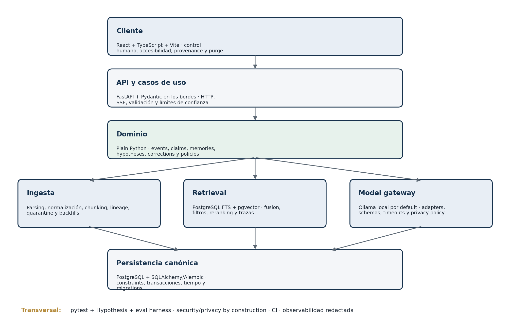
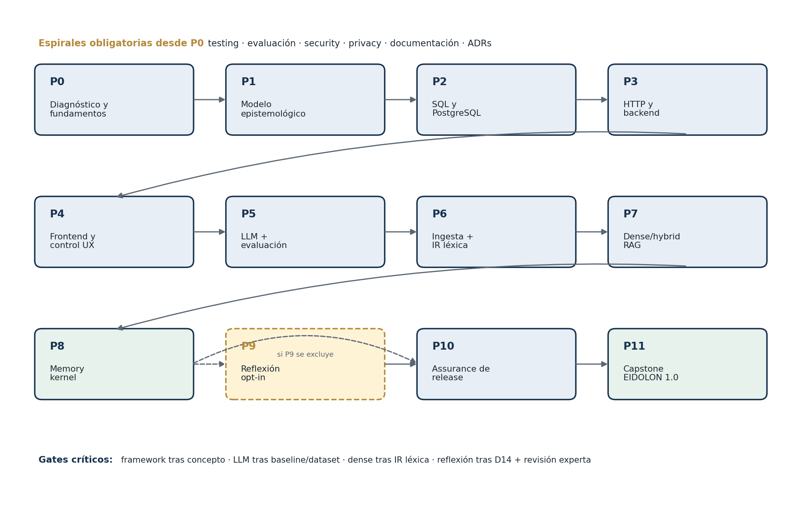

<!--
Artifact: Engineering Curriculum — overview
Architecture version: v0.3.0
Curriculum content source: EIDOLON_ENGINEERING_CURRICULUM_v0.2.docx
Scope: Parte I plus the Foundation Tracks bridge
Status: active
Migration rule: the body below is a structure-preserving Markdown conversion.
-->

**EIDOLON**

**ENGINEERING CURRICULUM**

Parte I — Fundamentos y arquitectura curricular

*Executive Overview · Architecture · Competencies · Dependencies · Phases · Technology Priorities*

**Comprender → implementar → probar → integrar → evaluar → optimizar → enseñar**

Versión del currículo: v0.1

Base canónica: Master Prompt + Curriculum Blueprint v0.2

Fecha de corte: 25 de agosto de 2026

*Estado: primera entrega; los tracks detallados se agregarán en versiones posteriores*

# Contrato de esta entrega

Este documento inicia el EIDOLON Engineering Curriculum. Define los fundamentos que gobernarán todas las expansiones posteriores: alcance del producto, arquitectura, dominios, niveles de dominio, dependencias, fases y prioridades tecnológicas. No contiene todavía los Detailed Domain Guides, laboratorios completos, bancos de preguntas, lecturas comentadas, exámenes prácticos ni el Capstone detallado.

| **Regla de estabilidad.** Las secciones 1–7 funcionan como interfaz curricular estable. Los tracks posteriores deberán referenciar IDs Dn.m, fases P0–P11, gates y niveles existentes; no podrán redefinirlos silenciosamente. |
|--------------------------------------------------------------------------------------------------------------------------------------------------------------------------------------------------------------------------------|

## Fuentes canónicas

- EIDOLON_MASTER_PROMPT.md — objetivos, profundidad, formato de aprendizaje, alcance técnico y criterio de dominio.

- EIDOLON_CURRICULUM_BLUEPRINT_v0.2 — decisiones corregidas, 17 dominios, 51 competencias, 12 fases, pesos, gates, prioridades y alcance de EIDOLON 1.0.

*En caso de tensión, v0.2 gobierna la secuencia y las decisiones corregidas; el Master Prompt gobierna la intención educativa y los entregables finales. Una modificación futura deberá quedar registrada mediante un Architecture Decision Record (ADR) curricular.*

## Contenido actual y espacio reservado

- 1\. Executive Overview

- 2\. Architecture Overview

- 3\. Engineering Competency Map

- 4\. Skill Levels

- 5\. Dependency Graph

- 6\. Learning Phases

- 7\. Technology Priority Matrix

*Las futuras Partes II–V incorporarán los tracks técnicos, laboratorios, milestones, lecturas, evaluación, certificación, Capstone, Future Knowledge Map, glossary y Final Master Checklist sin renumerar estas siete secciones.*

SECCIÓN 1

# Executive Overview

*Qué forma este currículo, qué producto habilita y cómo se demostrará el dominio.*

## 1.1 Propósito

El EIDOLON Engineering Curriculum es una formación profesional basada en evidencia para que un estudiante de Ingeniería en Sistemas Computacionales pueda diseñar, construir, explicar, probar, evaluar, asegurar y mantener EIDOLON. El objetivo no es acumular cursos ni frameworks, sino producir un sistema local-first verificable y una cadena de evidencia sobre su corrección, calidad y riesgo.

EIDOLON se define como un compañero de inteligencia artificial (AI companion) con comprensión longitudinal: conserva acontecimientos, recupera evidencia, modela tiempo, personas y relaciones, y puede formular hipótesis revisables. No es una herramienta médica ni diagnóstica. Su principio epistemológico central es que los registros originales permanecen trazables durante su periodo de retención, mientras las interpretaciones pueden corregirse, reemplazarse o eliminarse según políticas explícitas.

## 1.2 Alcance canónico de EIDOLON 1.0

- Aplicación web local y de un solo usuario (single-user), enlazada a loopback.

- Monolito modular con frontend React/TypeScript/Vite, backend FastAPI y dominio en Plain Python.

- PostgreSQL como fuente de verdad (source of truth); pgvector y full-text search como capacidades de recuperación.

- Ollama local por default detrás de un model gateway neutral; proveedores remotos solo con política de egress y consentimiento.

- Memoria temporal, autobiográfica y relacional con provenance, correcciones, contradicciones, abstention y purge verificable.

- La reflexión psicológica es experimental, opt-in, removible y no diagnóstica; EIDOLON 1.0 debe funcionar sin ella.

| **Fuera de v1.0.** Self-hosting remoto, microservices, Kubernetes, Kafka, graph databases, fine-tuning y workflows durables basados en LangGraph no pertenecen al core. Solo se abren con un problema real, un baseline y un trigger medido. |
|----------------------------------------------------------------------------------------------------------------------------------------------------------------------------------------------------------------------------------------------|

## 1.3 Principios rectores

**Problema antes que tecnología.** Primero se define el problema, luego el concepto transferible y finalmente la herramienta.

**Framework después de fundamento.** SQL antes del ORM; HTML/JavaScript antes de React; HTTP y async antes de FastAPI; state machines y jobs antes de LangGraph.

**Evaluación antes de optimización.** Toda capacidad de AI parte de tarea, baseline, dataset, contrato y taxonomía de errores.

**Security y privacy por construcción.** Comienzan en P0 y acumulan evidencia; P10 realiza assurance, no un parche tardío.

**Separación epistemológica.** Source, observation, claim, inference, hypothesis y correction son objetos distintos y auditables.

**Local-first verificable.** Local no significa automáticamente seguro; browser, procesos, logs, backups y egress permanecen en el threat model.

**Progresión espiral.** Los conceptos vuelven con mayor profundidad cuando una versión del producto los necesita.

**Evidencia sobre tiempo invertido.** Las horas son presupuesto de trabajo; el gate se aprueba demostrando una capacidad.

## 1.4 Definición de éxito

- El estudiante entra por un diagnóstico reproducible y cierra brechas concretas.

- Cada fase produce código, tests, datos de evaluación, documentación, un ADR y evidencia de security/privacy.

- Cada interpretación longitudinal puede rastrearse a evidencia, recibir contraevidencia, corregirse, abstenerse y dejar de influir después de un purge.

- El sistema puede cambiar de proveedor de modelos o embeddings sin perder contratos ni datos canónicos.

- Un revisor independiente puede instalar EIDOLON 1.0 desde un entorno limpio, reproducir resultados y auditar sus límites.

- El autor puede explicar cuándo no utilizar una técnica y defender una alternativa más simple.

## 1.5 Contrato de extensión para los tracks posteriores

1.  Referenciar uno o más IDs de competencia Dn.m y declarar el nivel de salida.

2.  Declarar fase, prerrequisitos, gates de entrada y artefacto de integración EIDOLON.

3.  Diferenciar \[MUST\], \[SHOULD\], \[NICE\] y \[LATER\] dentro del contenido.

4.  Separar ruta mínima, recomendada y de dominio profundo sin permitir que la mínima omita safety gates.

5.  Incluir teoría, práctica, laboratorios, errores comunes, evaluación y criterio observable de aprobación.

6.  Producir evidencia para GitHub: README, tests, instrucciones reproducibles y al menos un ADR.

7.  Registrar cualquier nueva tecnología en la Priority Matrix y en el Dependency Graph antes de incorporarla.

SECCIÓN 2

# Architecture Overview

*Arquitectura del producto que el currículo construye de manera incremental.*

## 2.1 Tesis arquitectónica

EIDOLON 1.0 se diseña como un monolito modular local. La frontera fundamental no está entre servicios desplegados, sino entre responsabilidades y niveles de confianza. El frontend controla la interacción; el API valida transporte; el dominio expresa invariantes; PostgreSQL conserva los registros canónicos; ingesta, retrieval y model gateway son componentes reemplazables; quality, security y privacy atraviesan todas las capas.

*Figura 1. Arquitectura lógica objetivo de EIDOLON 1.0.*

## 2.2 Capas y responsabilidades

| **Capa**          | **Default**                            | **Responsabilidad**                                                              |
|-------------------|----------------------------------------|----------------------------------------------------------------------------------|
| **Cliente**       | React + TypeScript + Vite              | Chat, timeline, provenance, corrección, export/purge, settings y accesibilidad.  |
| **API**           | FastAPI + Pydantic                     | Validación de transporte, casos de uso, límites de confianza y SSE.              |
| **Dominio**       | Plain Python                           | Events, claims, memory candidates, evidence, hypotheses, corrections y policies. |
| **Persistencia**  | PostgreSQL + SQLAlchemy/Alembic        | Registros canónicos, constraints, transacciones, temporalidad y migrations.      |
| **Ingesta**       | Jobs explícitos                        | Parsing, normalización, chunking, lineage, backfills y quarantine.               |
| **Retrieval**     | PostgreSQL FTS + pgvector              | Lexical/dense candidates, filtros, fusion, optional rerank y trazas.             |
| **Model gateway** | Ollama default + APIs opcionales       | Capabilities, structured outputs, privacy policy, timeout y version logging.     |
| **Workflows**     | State machines/jobs; LangGraph después | Aprobación humana, retries, idempotencia y resumibilidad cuando se justifique.   |
| **Quality**       | pytest + Hypothesis + eval harness     | Correctness, retrieval, memory, generation, safety y privacy por separado.       |
| **Ops**           | Docker/Compose + CI                    | Reproducibilidad, observabilidad redactada, backup/restore y releases.           |

## 2.3 Objetos canónicos e invariantes

El currículo no trata el 'recuerdo' como una sola fila de texto. Modela explícitamente el origen, la proposición, la entidad, el tiempo, la evidencia y el ciclo de vida de las interpretaciones.

| **Objeto**                  | **Significado**                                 | **Invariante**                                                           |
|-----------------------------|-------------------------------------------------|--------------------------------------------------------------------------|
| **SourceRecord**            | Payload original y metadata                     | Se conserva durante retención; purge explícito elimina contenido.        |
| **Event**                   | Acontecimiento afirmado con valid/recorded time | Append-only durante retención; puede ser superseded.                     |
| **Claim**                   | Proposición atómica atribuible                  | Subject/predicate/value, source, time, status y confidence semantics.    |
| **Entity/Person**           | Ancla de identidad y aliases                    | Merge reversible; nombre igual no basta.                                 |
| **RelationshipState**       | Relación versionada                             | Temporal y evidence-backed; no perfil plano mutable.                     |
| **MemoryCandidate**         | Representación derivada propuesta               | No influye persistentemente sin policy/approval.                         |
| **Memory**                  | Representación derivada aceptada                | Versionada, reconstruible y nunca source fact.                           |
| **Hypothesis**              | Interpretación tentativa                        | Alternativas, support/refute evidence, uncertainty y lifecycle.          |
| **EvidenceEdge**            | Vínculo tipado                                  | Registra provenance y transformation version.                            |
| **Correction/PurgeReceipt** | Cambio de estado o eliminación                  | Actualiza proyecciones; purge reporta completion/error y backup horizon. |

## 2.4 Flujo epistemológico

1.  SourceRecord conserva el payload y su metadata durante la retención autorizada.

2.  Event y Claim expresan acontecimientos y proposiciones atribuibles con tiempo válido y tiempo de registro.

3.  Ingesta y retrieval producen candidatos y evidencia; no reescriben la fuente canónica.

4.  MemoryCandidate requiere política y, para capacidades sensibles, aprobación humana antes de convertirse en Memory.

5.  Hypothesis conserva alternativas, support/refute evidence, incertidumbre y lifecycle; nunca se promueve automáticamente a hecho.

6.  Correction, supersession y purge actualizan proyecciones y derivados sin falsificar el historial de lo que se creyó en cada momento.

## 2.5 Límites de confianza y despliegue

**Browser/client.** Entradas manipulables, XSS/CSRF, estados optimistas y confirmación de acciones destructivas.

**API.** Validación, límites de tamaño/tiempo, host binding, autorización futura y semántica idempotente.

**Modelo.** Salida no confiable; schemas, timeouts, refusals, version logging y prohibición de efectos autónomos en v1.0.

**Documentos/corpus.** Posible prompt injection indirecta, contenido malicioso, OCR defectuoso y poisoning.

**Persistencia y backups.** Least privilege, cifrado, restore, retención y propagación verificable del purge.

**Egress.** Deny-by-default; preview, redaction y consentimiento explícito por clase de dato.

| **Decisión de versión.** EIDOLON 1.1 podrá añadir self-hosting remoto únicamente después de diseñar AuthN/AuthZ, TLS, actualización, rate limits, secrets, exposición de red e incident response como un perfil operativo separado. |
|-------------------------------------------------------------------------------------------------------------------------------------------------------------------------------------------------------------------------------------|

SECCIÓN 3

# Engineering Competency Map

*Dominios, pesos y competencias trazables que gobiernan lecciones, labs, builds y exámenes.*

## 3.1 Mapa de dominios

| **ID**  | **Dominio**                            | **Peso** | **Nivel objetivo** | **Contribución al sistema**                                             |
|---------|----------------------------------------|----------|--------------------|-------------------------------------------------------------------------|
| **D1**  | Programación e ingeniería de software  | 8%       | Profesional        | Código mantenible, debugging, Git, packaging y decisiones trazables.    |
| **D2**  | Fundamentos algorítmicos y matemáticos | 4%       | Aplicado           | Estructuras, complejidad, lógica, grafos y máquinas de estado.          |
| **D3**  | Sistemas, concurrencia y redes         | 5%       | Aplicado           | Procesos, memoria, filesystem, async, DNS, TCP, TLS y HTTP.             |
| **D4**  | Backend y APIs                         | 6%       | Profesional        | Contratos HTTP, FastAPI/Pydantic, arquitectura modular y jobs.          |
| **D5**  | Datos relacionales                     | 8%       | Profesional        | PostgreSQL, constraints, transacciones, índices, migrations y restore.  |
| **D6**  | Frontend e interacción                 | 5%       | Aplicado           | UI auditable, accesible y segura para control, correction y purge.      |
| **D7**  | Ingesta y gobierno de datos            | 5%       | Profesional        | Parsing, normalización, lineage, retención, exportación y evolución.    |
| **D8**  | Ingeniería de LLMs                     | 8%       | Profesional        | Inference, prompting, structured outputs y contratos de proveedor.      |
| **D9**  | Information Retrieval y RAG            | 10%      | Profesional        | Ranking léxico/denso, fusion, reranking, contexto y métricas.           |
| **D10** | Memoria temporal y de entidades        | 10%      | Profesional        | Tiempo, identidad, relaciones, contradicción, revisión y consolidación. |
| **D11** | Testing y evaluación de AI             | 8%       | Profesional        | Correctness, datasets, graders, incertidumbre, regresión y monitoring.  |
| **D12** | Seguridad                              | 6%       | Profesional        | Threat modeling, AppSec, LLM security, supply chain y verificación.     |
| **D13** | Privacidad y protección de datos       | 5%       | Profesional        | Minimización, consentimiento, egress, cifrado, purge y backups.         |
| **D14** | Estadística y métodos de investigación | 5%       | Aplicado           | Bayes, medición, validez, causalidad y evaluación longitudinal.         |
| **D15** | Psicología y reflexión responsable     | 4%       | Aplicado estricto  | Evidencia, límites de constructos, contraevidencia y abstention.        |
| **D16** | Producción y open source               | 3%       | Aplicado           | Docker, CI/CD, observabilidad, restore, licencias y releases.           |
| **D17** | Especializaciones post-v1.0            | 0%       | Research/Optional  | LangGraph, distribución, graph DB, PyTorch y fine-tuning por trigger.   |

*Los pesos D1–D16 suman 100%. D17 no forma parte del core ni puede compensar una debilidad en dominios obligatorios.*

## 3.2 Catálogo trazable de competencias

Cada ID siguiente deberá aparecer en módulos, laboratorios, repositorios y exámenes. La evidencia indicada es el mínimo; los tracks detallados podrán exigir evidencia adicional, pero no sustituirla por horas o certificados externos.

| **ID**   | **Competencia**                                     | **Fases** | **Evidencia mínima**         |
|----------|-----------------------------------------------------|-----------|------------------------------|
| **D1.1** | Python idiomático, tipos y manejo de errores        | P0-P3     | Implementación + code review |
| **D1.2** | Debugging, logging, packaging y dependencias        | P0-P5     | Failure lab + release        |
| **D1.3** | Git, documentación, ADR y revisión                  | P0-P11    | Repositorio y defensa        |
| **D2.1** | Estructuras de datos y complejidad                  | P0-P1     | Problemas y explicación      |
| **D2.2** | Lógica, conjuntos, grafos y máquinas de estado      | P1, P8    | Modelo e invariantes         |
| **D2.3** | Unicode, serialización, tiempo y precisión numérica | P0-P2     | Tests de edge cases          |
| **D3.1** | Procesos, memoria, filesystem y environment         | P0-P3     | Diagnóstico de sistema       |
| **D3.2** | Concurrencia, async, cancelación e idempotencia     | P3, P8    | Race/failure labs            |
| **D3.3** | DNS, TCP, TLS y HTTP                                | P3-P4     | Trazado de request           |
| **D4.1** | Semántica HTTP y diseño de APIs                     | P3        | Contrato OpenAPI             |
| **D4.2** | FastAPI/Pydantic como bordes                        | P3-P5     | Contract tests               |
| **D4.3** | Arquitectura modular y background jobs              | P3, P8    | ADR + job idempotente        |
| **D5.1** | SQL, modelado relacional y constraints              | P2        | Schema + consultas           |
| **D5.2** | Transacciones, MVCC, isolation y locks              | P2-P3     | Concurrency lab              |
| **D5.3** | Índices, EXPLAIN, migrations y restore              | P2, P10   | Plan + restore drill         |
| **D6.1** | HTML/CSS/JavaScript y browser runtime               | P4        | UI sin framework primero     |
| **D6.2** | TypeScript, React y estado                          | P4-P5     | Component/e2e tests          |

## 3.2 Catálogo trazable de competencias (continuación)

| **ID**    | **Competencia**                                  | **Fases**   | **Evidencia mínima**       |
|-----------|--------------------------------------------------|-------------|----------------------------|
| **D6.3**  | Accesibilidad y UX de control                    | P4-P11      | Auditoría WCAG + usability |
| **D7.1**  | Parsing, normalización, chunking y lineage       | P6          | Corpus reproducible        |
| **D7.2**  | Clasificación, consentimiento y retención        | P1, P6, P10 | Data inventory             |
| **D7.3**  | Versionado, backfills, export e import           | P1-P10      | Migration/replay           |
| **D8.1**  | Tokens, inference, sampling y quantization       | P5          | Experimento controlado     |
| **D8.2**  | Structured outputs y provider contracts          | P5          | Schema/retry tests         |
| **D8.3**  | Prompting, grounding, tools sin efectos y Ollama | P5-P7       | Eval regression            |
| **D9.1**  | Inverted index, TF-IDF/BM25 y etiquetas          | P6          | Lexical benchmark          |
| **D9.2**  | Embeddings, similitud, pgvector y ANN            | P7          | Exact vs ANN               |
| **D9.3**  | Fusion, reranking, context assembly y RAG        | P7-P8       | Component eval             |
| **D10.1** | Eventos, claims, provenance y bitemporalidad     | P1-P2, P8   | Temporal tests             |
| **D10.2** | Entity resolution y relaciones                   | P8          | Identity benchmark         |
| **D10.3** | Consolidación, contradicción y revisiones        | P8-P9       | Longitudinal replay        |
| **D11.1** | Testing unit/integration/e2e/property            | P0-P11      | Suite por fase             |
| **D11.2** | Datasets, splits, leakage y métricas             | P5-P9       | Versioned eval set         |
| **D11.3** | Graders, LLM judge, incertidumbre y monitoring   | P5-P11      | Calibración humana         |
| **D12.1** | Threat modeling y AppSec                         | P0-P4, P10  | Threat model + ASVS        |

## 3.2 Catálogo trazable de competencias (continuación)

| **ID**    | **Competencia**                                   | **Fases**        | **Evidencia mínima**          |
|-----------|---------------------------------------------------|------------------|-------------------------------|
| **D12.2** | Prompt injection, poisoning, tool boundaries      | P5-P10           | LLMSVS/red team               |
| **D12.3** | Supply chain, SBOM y model provenance             | P0, P10          | CI evidence                   |
| **D13.1** | Privacy by design y data minimization             | P0-P11           | Privacy risk register         |
| **D13.2** | Consentimiento, egress y datos de terceros        | P1, P5-P10       | Policy tests                  |
| **D13.3** | Cifrado, keys, purge y backups                    | P2-P3, P10       | Delete/restore drill          |
| **D14.1** | Probabilidad, Bayes e intervalos                  | P5-P9            | Análisis de eval              |
| **D14.2** | Medición, reliability y validity                  | P6-P9            | Rúbrica y error               |
| **D14.3** | Causalidad, confounders y longitudinalidad        | P8-P9            | Crítica de inferencias        |
| **D15.1** | Jerarquía de evidencia y replicabilidad           | P9               | Revisión de literatura        |
| **D15.2** | Constructos psicológicos y límites                | P9               | Evidence map                  |
| **D15.3** | Reflexión segura, abstention y prohibited outputs | P9-P11           | Expert red team               |
| **D16.1** | Docker/Compose y CI/CD                            | P3 opcional, P10 | Build reproducible            |
| **D16.2** | Observabilidad, SLO, backup y restore             | P5, P10-P11      | Disaster drill                |
| **D16.3** | Licencias, releases y contributor governance      | P10-P11          | Release candidate             |
| **D17.1** | LangGraph y durable workflows                     | 1.x              | Solo con workflow trigger     |
| **D17.2** | Qdrant/Neo4j/OpenSearch/Redis/distribución        | 1.x              | Solo con scale/query trigger  |
| **D17.3** | Hugging Face, PyTorch y fine-tuning               | 1.x              | Solo con dataset/task trigger |

## 3.3 Reglas de balance

- D8–D10 no pueden dominar el currículo a costa de D1–D7: un sistema de memoria requiere software, datos y sistemas sólidos antes de técnicas de AI.

- D11–D13 son dominios de producto, no apéndices de compliance. Su evidencia se produce en cada fase.

- D14 precede a D15. La reflexión psicológica no se implementa antes de medición, validez, incertidumbre y causalidad.

- D16 endurece y publica un sistema ya comprendido; Docker no sustituye el entendimiento de procesos, red, archivos o configuración.

- D17 se mantiene fuera del porcentaje core para evitar que tecnologías avanzadas prematuras se conviertan en objetivos por sí mismas.

SECCIÓN 4

# Skill Levels

*Escalas separadas para dominio, prioridad curricular y profundidad matemática.*

## 4.1 Escala de dominio

| **Nivel**                               | **Qué debe poder demostrar**                                                           | **Autoridad dentro de EIDOLON**                                                     |
|-----------------------------------------|----------------------------------------------------------------------------------------|-------------------------------------------------------------------------------------|
| **Foundation / Fundacional**            | Explica conceptos, traza ejemplos y completa tareas guiadas con feedback.              | No aprueba una release ni diseña una frontera crítica.                              |
| **Working Knowledge / Aplicado**        | Implementa y depura casos comunes; explica tradeoffs y límites principales.            | Suficiente para dominios de soporte y colaboración supervisada.                     |
| **Professional / Profesional**          | Diseña, prueba, migra, opera y rechaza usos inapropiados; responde ante fallas.        | Obligatorio en backend, datos, ingesta, LLM, IR, memoria, eval, security y privacy. |
| **Advanced / Avanzado**                 | Optimiza bajo escala, fiabilidad u organización y compara arquitecturas alternativas.  | Post-v1.0 o activado por un bottleneck medido.                                      |
| **Research / Optional / Investigación** | Lee fuentes primarias, reproduce resultados y critica incertidumbre y validez externa. | No bloquea el MVP salvo investigación de safety requerida por P9.                   |

## 4.2 Evidencia por verbo

| **Verbo**       | **Evidencia observable**                                                                |
|-----------------|-----------------------------------------------------------------------------------------|
| **Explicar**    | Defender conceptos, invariantes y tradeoffs sin depender de un tutorial.                |
| **Implementar** | Construir desde una especificación acotada y justificar decisiones.                     |
| **Probar**      | Diseñar tests positivos, negativos, de invariantes y de fallas.                         |
| **Integrar**    | Conectar el componente al release anterior sin romper contratos ni datos.               |
| **Evaluar**     | Comparar contra un baseline, atribuir errores e interpretar incertidumbre.              |
| **Criticar**    | Reconocer una técnica prematura, insegura, no medible o innecesaria.                    |
| **Operar**      | Instalar, configurar, migrar, observar, restaurar, actualizar y responder a incidentes. |
| **Enseñar**     | Comunicar el diseño mediante README, ADR, diagramas y defensa técnica.                  |

## 4.3 Tres etiquetas que no deben confundirse

**Nivel de dominio.** Qué tan autónomamente puede actuar el estudiante sobre una competencia.

**Prioridad tecnológica.** Cuándo conviene invertir en una herramienta: LEARN NOW, LEARN SOON, LEARN LATER, ONLY IF NEEDED o DO NOT PRIORITIZE.

**Prioridad de contenido.** Qué parte de un módulo es \[MUST\], \[SHOULD\], \[NICE\] o \[LATER\]. Una tecnología puede ser LEARN SOON y contener temas internos \[MUST\] y \[NICE\].

## 4.4 Profundidad matemática

| **Nivel**                         | **Alcance**                                                  | **Ejemplos en EIDOLON**                                   |
|-----------------------------------|--------------------------------------------------------------|-----------------------------------------------------------|
| **M0 — Intuición**                | Explicar la idea y anticipar la dirección del efecto.        | Big O, probabilidad, similitud, ranking.                  |
| **M1 — Fórmulas prácticas**       | Calcular, implementar y validar fórmulas estándar.           | Cosine similarity, Precision@K, Bayes básico, intervalos. |
| **M2 — Comprensión matemática**   | Derivar supuestos, límites y sensibilidad de métodos usados. | BM25, regresión, calibración, attention a nivel técnico.  |
| **M3 — Derivación/investigación** | Reproducir papers o desarrollar métodos nuevos.              | Rerankers propios, fine-tuning, investigación post-v1.0.  |

| **Regla de aprobación.** Familiaridad, consumo de cursos y horas registradas no equivalen a dominio. El nivel se concede por la evidencia más alta demostrada de forma reproducible. |
|--------------------------------------------------------------------------------------------------------------------------------------------------------------------------------------|

SECCIÓN 5

# Dependency Graph

*Orden conceptual, gates de entrada y dependencias transversales.*

## 5.1 Grafo principal

La secuencia no es una lista rígida de herramientas: es una red de prerrequisitos. Security, privacy, testing, evaluación y documentación se desarrollan en espiral; no son fases aisladas. P9 es una rama condicional: si su safety gate falla, se excluye sin bloquear el engineering core de P10–P11.

*Figura 2. Dependencias principales entre fases P0–P11.*

## 5.2 Gates conceptuales obligatorios

| **Antes de…**               | **Debe existir evidencia de…**                                                                   |
|-----------------------------|--------------------------------------------------------------------------------------------------|
| **P1**                      | Python básico, tests, Git, Unicode, fechas y máquinas de estado simples.                         |
| **un ORM**                  | SQL, joins, constraints y transacciones escritos a mano.                                         |
| **async web**               | Procesos, event loop, cancelación, timeouts y ownership de recursos.                             |
| **React**                   | HTML/CSS, JavaScript, browser events y HTTP.                                                     |
| **el primer LLM**           | Definición de tarea, baseline determinista, dataset pequeño, threat boundary y schema de salida. |
| **dense retrieval**         | Corpus reproducible, baseline léxico, relevance judgments y métricas.                            |
| **ANN/HNSW**                | Exact vector search medido y necesidad demostrada de latencia o escala.                          |
| **memory extraction**       | Provenance, corrections, human approval, purge propagation e identity policy.                    |
| **tools con efectos**       | Authorization, allowlist, confirmation, idempotency, sandboxing y audit log.                     |
| **reflexión psicológica**   | D14, safety charter, expert review, prohibited outputs y opt-in UX.                              |
| **datos privados**          | Data inventory, egress policy, logs redactados, export/purge y restore verificados.              |
| **LangGraph o fine-tuning** | Trigger medido, baseline fuerte, dataset propio y costo/beneficio documentado.                   |

## 5.3 Reglas para paralelizar sin romper dependencias

- D2 y D3 pueden estudiarse en paralelo con P0–P3, siempre que el concepto requerido se apruebe antes del laboratorio que lo utiliza.

- D6 puede comenzar con HTML/CSS/JavaScript mientras P3 madura; la integración React espera un contrato HTTP estable.

- D14 puede adelantarse desde P5 para apoyar evals, pero debe completarse antes de P9.

- Security/privacy labs se ejecutan sobre cada build vigente; no esperan a P10.

- Lecturas de D17 pueden explorarse por curiosidad, pero no deben alterar la arquitectura ni consumir el presupuesto del core sin trigger.

SECCIÓN 6

# Learning Phases

*Doce fases construyen EIDOLON de forma incremental, medible y reversible.*

## 6.1 Resumen de rutas y esfuerzo

Las rutas mínima, recomendada y profesional suman aproximadamente 905, 1,690 y 2,710 horas. Son presupuestos para planear; no sustituyen los gates. La ruta mínima reduce lecturas, repeticiones y variantes, pero no elimina pruebas, security, privacy, evaluación ni la defensa final.

| **ID**  | **Foco**                                              | **Build**                                  | **Mín./rec./prof.** |
|---------|-------------------------------------------------------|--------------------------------------------|---------------------|
| **P0**  | Diagnóstico y puente de preparación                   | EIDOLON 0.0a - laboratorio reproducible    | 50 / 90 / 140 h     |
| **P1**  | Modelado epistemológico sin frameworks                | EIDOLON 0.1 - journal de provenance        | 60 / 110 / 180 h    |
| **P2**  | SQL, PostgreSQL y persistencia transaccional          | EIDOLON 0.2 - núcleo de datos              | 80 / 150 / 230 h    |
| **P3**  | HTTP, backend y límites de confianza                  | EIDOLON 0.3 - data service                 | 70 / 130 / 210 h    |
| **P4**  | Frontend, accesibilidad y UX de control               | EIDOLON 0.4 - companion shell              | 70 / 130 / 200 h    |
| **P5**  | LLM engineering guiado por evaluación                 | EIDOLON 0.5 - model gateway evaluado       | 75 / 140 / 220 h    |
| **P6**  | Ingesta, corpus y recuperación léxica                 | EIDOLON 0.6 - evidence search              | 60 / 110 / 180 h    |
| **P7**  | Embeddings, búsqueda híbrida y RAG                    | EIDOLON 0.7 - RAG híbrido                  | 70 / 130 / 210 h    |
| **P8**  | Memoria autobiográfica, temporal y relacional         | EIDOLON 0.8 - memory kernel                | 90 / 170 / 270 h    |
| **P9**  | Método científico y reflexión psicológica restringida | EIDOLON 0.9a - reflection research preview | 90 / 180 / 300 h    |
| **P10** | Security, privacy y production assurance              | EIDOLON 0.9b - private release candidate   | 90 / 170 / 270 h    |
| **P11** | Capstone integrado y defensa profesional              | EIDOLON 1.0 - companion auditable local    | 100 / 190 / 300 h   |

## 6.2 Fichas de fase

### P0 — Diagnóstico y puente de preparación

**Build.** EIDOLON 0.0a — laboratorio reproducible

**Esfuerzo mínimo / recomendado / profesional.** 50 / 90 / 140 h

**Prerrequisitos.** Ninguno; diagnóstico inicial obligatorio.

**Objetivo.** Cerrar brechas mínimas de programación, terminal y pensamiento computacional sin posponer el proyecto indefinidamente.

**Núcleo de aprendizaje.** Python estándar, pytest, Git, logging, pyproject.toml, debugging, complejidad básica, Unicode, fechas y zonas horarias.

**Integración EIDOLON.** CLI determinista que registra y filtra eventos sintéticos; sin LLM, Pydantic, Docker ni base de datos.

**Gate de aprobación.** Implementa desde una spec pequeña, explica complejidad y pasa pruebas de Unicode/tiempo.

### P1 — Modelado epistemológico sin frameworks

**Build.** EIDOLON 0.1 — journal de provenance

**Esfuerzo mínimo / recomendado / profesional.** 60 / 110 / 180 h

**Prerrequisitos.** P0; lógica, conjuntos y máquinas de estado básicas.

**Objetivo.** Separar source, observation, claim, inference, hypothesis y correction antes de automatizar.

**Núcleo de aprendizaje.** Dataclasses/stdlib, JSONL versionado, funciones puras, hashing con límites, valid time/recorded time, schema evolution y property tests introductorios.

**Integración EIDOLON.** Journal auditable con export, correction, supersession y deletion receipt.

**Gate de aprobación.** Toda salida identifica su fuente o carácter derivado; replay y borrado son reproducibles.

### P2 — SQL, PostgreSQL y persistencia transaccional

**Build.** EIDOLON 0.2 — núcleo de datos

**Esfuerzo mínimo / recomendado / profesional.** 80 / 150 / 230 h

**Prerrequisitos.** P1; álgebra relacional informal y SQL antes del ORM.

**Objetivo.** Traducir invariantes del dominio a constraints y transacciones reales.

**Núcleo de aprendizaje.** Modelado relacional, normalización, PK/FK, MVCC, isolation, locks, B-tree/GIN, EXPLAIN, migrations, backup/restore; SQLAlchemy 2 y Alembic después de SQL manual.

**Integración EIDOLON.** Persistencia PostgreSQL del journal, sin API pública y sin Docker obligatorio.

**Gate de aprobación.** Diseña el schema, prueba transaction boundaries, interpreta EXPLAIN y restaura una base migrada.

### P3 — HTTP, backend y límites de confianza

**Build.** EIDOLON 0.3 — data service

**Esfuerzo mínimo / recomendado / profesional.** 70 / 130 / 210 h

**Prerrequisitos.** P2; procesos, sockets, DNS, TCP, TLS y HTTP prácticos.

**Objetivo.** Exponer casos de uso mediante contratos estables sin mezclar transporte, dominio y persistencia.

**Núcleo de aprendizaje.** HTTP semantics, REST, OpenAPI, CORS/CSRF, sync/async, cancelación, idempotencia; FastAPI y Pydantic solo en bordes; service layer y contract tests.

**Integración EIDOLON.** API local para sources, events, claims, corrections, export y purge; bind a loopback.

**Gate de aprobación.** Conserva invariantes bajo errores, concurrencia y entradas hostiles; threat model v1 aprobado.

### P4 — Frontend, accesibilidad y UX de control

**Build.** EIDOLON 0.4 — companion shell

**Esfuerzo mínimo / recomendado / profesional.** 70 / 130 / 200 h

**Prerrequisitos.** P3; HTML/CSS y JavaScript antes de React.

**Objetivo.** Hacer visibles provenance, incertidumbre, corrección, export y borrado.

**Núcleo de aprendizaje.** Browser runtime, TypeScript, React, Vite, estado cliente/servidor, keyboard navigation, WCAG 2.2, component/e2e tests y threat-aware UX.

**Integración EIDOLON.** Shell sin inteligencia: historial, timeline, review, export y purge sobre datos sintéticos.

**Gate de aprobación.** Acciones destructivas inspeccionables y recuperables; sin dark patterns; auditoría de accesibilidad aprobada.

### P5 — LLM Engineering guiado por evaluación

**Build.** EIDOLON 0.5 — model gateway evaluado

**Esfuerzo mínimo / recomendado / profesional.** 75 / 140 / 220 h

**Prerrequisitos.** P3–P4; probabilidad, muestreo y diseño experimental básicos.

**Objetivo.** Agregar modelos como componentes no confiables detrás de contratos y evals desde el primer día.

**Núcleo de aprendizaje.** Tokens, context windows, inference, sampling, quantization, prompting, structured outputs, grounding, Ollama, adapter neutral, retries, timeouts, versionado, datasets y graders.

**Integración EIDOLON.** Chat con metadata de modelo y citas a contexto explícito; cero escrituras autónomas de memoria.

**Gate de aprobación.** Cada cambio de prompt/modelo se compara contra baseline y reporta variabilidad o intervalos.

### P6 — Ingesta, corpus y recuperación léxica

**Build.** EIDOLON 0.6 — evidence search

**Esfuerzo mínimo / recomendado / profesional.** 60 / 110 / 180 h

**Prerrequisitos.** P2 y P5; normalización textual, precision/recall y muestreo de juicios.

**Objetivo.** Construir un corpus reproducible y un baseline léxico medible antes de embeddings.

**Núcleo de aprendizaje.** Parsing, chunking, lineage, OCR/Unicode, inverted index, TF-IDF/BM25, analyzers, metadata, leakage, relevance judgments y PostgreSQL Full Text Search.

**Integración EIDOLON.** Panel de búsqueda de evidencia con provenance completa; pgvector todavía no es obligatorio.

**Gate de aprobación.** Corpus, splits, etiquetas y baseline versionados; errores de ingesta y retrieval separados.

### P7 — Embeddings, búsqueda híbrida y RAG

**Build.** EIDOLON 0.7 — RAG híbrido

**Esfuerzo mínimo / recomendado / profesional.** 70 / 130 / 210 h

**Prerrequisitos.** P6; vectores, producto punto, coseno y métricas de ranking.

**Objetivo.** Añadir recuperación densa únicamente contra el baseline léxico existente.

**Núcleo de aprendizaje.** Embeddings, exact search, ANN/HNSW condicionados, filtros, Reciprocal Rank Fusion, reranking, context assembly, grounded generation y eval separada de retrieval/generation.

**Integración EIDOLON.** RAG híbrido con retrieval debug, citas verificables y abstention; sin memoria secreta.

**Gate de aprobación.** La combinación mejora casos definidos sin degradar seguridad, latencia o consultas léxicas difíciles.

### P8 — Memoria autobiográfica, temporal y relacional

**Build.** EIDOLON 0.8 — memory kernel

**Esfuerzo mínimo / recomendado / profesional.** 90 / 170 / 270 h

**Prerrequisitos.** P1–P3 y P6–P7; bitemporalidad, entity resolution y jobs idempotentes.

**Objetivo.** Construir memoria longitudinal preservando contradicción, tiempo, identidad, consentimiento y correcciones.

**Núcleo de aprendizaje.** Memoria episódica/semántica como categorías de ingeniería, entity resolution, modelos bitemporales, consolidation, conflict policies, evidence edges, replay, re-embedding y deletion propagation.

**Integración EIDOLON.** Timeline, personas, relaciones y memorias aceptadas/rechazadas con provenance completa.

**Gate de aprobación.** Benchmarks propios de identidad, temporalidad, actualización, abstention y borrado aprobados.

### P9 — Método científico y reflexión psicológica restringida

**Build.** EIDOLON 0.9a — reflection research preview

**Esfuerzo mínimo / recomendado / profesional.** 90 / 180 / 300 h

**Prerrequisitos.** P8; D14 completo; safety charter y revisión experta externa.

**Objetivo.** Probar una capa falsable de reflexión sin convertir conversación en evaluación psicológica.

**Núcleo de aprendizaje.** Validez, reliability, construct validity, base rates, confounders, causalidad, effect sizes, replicabilidad, hipótesis rivales, counterevidence, lenguaje calibrado y prohibited outputs.

**Integración EIDOLON.** Vista experimental opt-in; no activa por default ni promueve hipótesis a hechos.

**Gate de aprobación.** Evaluadores calificados aprueban rúbricas y red-team cases; si falla, la capacidad queda fuera de v1.0.

### P10 — Security, privacy y production assurance

**Build.** EIDOLON 0.9b — private release candidate

**Esfuerzo mínimo / recomendado / profesional.** 90 / 170 / 270 h

**Prerrequisitos.** P0–P9; controles incrementales ya implantados. P9 puede constar como excluido.

**Objetivo.** Convertir controles acumulados en evidencia verificable de release.

**Núcleo de aprendizaje.** ASVS, LLMSVS, NIST SSDF, privacy risk, LFPDPPP, key management, secure deletion limits, Docker/Compose, CI/CD, SBOM, model provenance, telemetry redactada, encrypted backup y incident/restore drills.

**Integración EIDOLON.** Perfil personal local endurecido; self-hosted remoto diferido a 1.1.

**Gate de aprobación.** Cada riesgo crítico tiene owner, control, test y evidencia; egress, purge y backups coinciden con la política.

### P11 — Capstone integrado y defensa profesional

**Build.** EIDOLON 1.0 — companion auditable local

**Esfuerzo mínimo / recomendado / profesional.** 100 / 190 / 300 h

**Prerrequisitos.** Gates P0–P10; P9 puede estar desactivado si no aprobó.

**Objetivo.** Integrar, medir, documentar y defender el sistema completo ante revisión independiente.

**Núcleo de aprendizaje.** Build completo, benchmark final, usability study, security review, restore, provider/model swap, embedding migration, limitations, roadmap economics y defensa.

**Integración EIDOLON.** Producto local single-user con chat, memory kernel, retrieval híbrido, controles de datos y documentación; reflexión solo si fue aprobada.

**Gate de aprobación.** Un revisor reproduce instalación y resultados; el autor explica, prueba, critica y mantiene cada componente central.

## 6.3 Checkpoints acumulativos

| **Checkpoint**          | **Después de** | **Pregunta de control**                                                          |
|-------------------------|----------------|----------------------------------------------------------------------------------|
| **C1 — Fundamentos**    | P1             | ¿Puedes modelar una corrección sin reescribir la fuente y probar el replay?      |
| **C2 — Data service**   | P3             | ¿Puedes explicar y probar cada transaction y trust boundary?                     |
| **C3 — Human control**  | P4             | ¿Puede el usuario inspeccionar, corregir, exportar y borrar sin ambigüedad?      |
| **C4 — Model contract** | P5             | ¿Puedes cambiar de modelo y comparar resultados contra un baseline reproducible? |
| **C5 — Retrieval**      | P7             | ¿Puedes demostrar cuándo lexical, dense o hybrid gana y por qué?                 |
| **C6 — Memory kernel**  | P8             | ¿Preserva identidad, tiempo, contradicción, correction y deletion?               |
| **C7 — Safety**         | P10            | ¿Coinciden threat model, política y comportamiento observado?                    |
| **C8 — Defensa**        | P11            | ¿Puede un tercero reproducir, auditar y cuestionar el sistema?                   |

SECCIÓN 7

# Technology Priority Matrix

*La prioridad se asigna por valor y dependencia, no por popularidad.*

## 7.1 Semántica operativa

| **Etiqueta**          | **Momento**               | **Regla**                                                                                |
|-----------------------|---------------------------|------------------------------------------------------------------------------------------|
| **LEARN NOW**         | P0–P2                     | Desbloquea el resto; debe dominarse antes de capas avanzadas.                            |
| **LEARN SOON**        | P3–P8                     | Construye el producto útil y sus capacidades centrales.                                  |
| **LEARN LATER**       | Después del memory kernel | Aumenta capacidad profesional o investigación, sin bloquear v1.0.                        |
| **ONLY IF NEEDED**    | Con trigger medido        | Se adopta solo si baseline, escala, operación o producto lo justifican.                  |
| **DO NOT PRIORITIZE** | Fuera de la ruta core     | Bajo retorno actual para EIDOLON; no implica que la tecnología carezca de valor general. |

## 7.2 Matriz canónica

| **Tecnología/conocimiento**                        | **Prioridad**     | **Primera fase**      | **Razón**                                              |
|----------------------------------------------------|-------------------|-----------------------|--------------------------------------------------------|
| **Python, pytest, Git/GitHub, Linux/Bash**         | LEARN NOW         | P0                    | Base de implementación y evidencia.                    |
| **Data structures, algorithms, discrete math**     | LEARN NOW         | P0-P1                 | Invariantes, ranking, estados y complejidad.           |
| **Unicode, fechas, zonas horarias, serialización** | LEARN NOW         | P0-P2                 | Evitan corrupción silenciosa.                          |
| **SQL y PostgreSQL**                               | LEARN NOW         | P1-P2                 | Source of truth e invariantes.                         |
| **Threat modeling y privacy by design**            | LEARN NOW         | P0 onward             | No puede diferirse hasta el beta.                      |
| **HTTP, TLS, DNS y async fundamentals**            | LEARN SOON        | P3                    | Antes de FastAPI/SSE.                                  |
| **SQLAlchemy 2 y Alembic**                         | LEARN SOON        | P2                    | Después de SQL manual.                                 |
| **FastAPI y Pydantic**                             | LEARN SOON        | P3                    | Bordes de transporte, no modelo universal.             |
| **JavaScript, TypeScript, React y Vite**           | LEARN SOON        | P4                    | Shell auditable y UX de control.                       |
| **WCAG 2.2 y usability testing**                   | LEARN SOON        | P4-P11                | Accesibilidad y acciones destructivas seguras.         |
| **Ollama y provider adapters**                     | LEARN SOON        | P5                    | Runtime local detrás de contrato.                      |
| **LLM evals y estadística aplicada**               | LEARN SOON        | P5 onward             | Eval-driven development.                               |
| **PostgreSQL FTS y lexical IR**                    | LEARN SOON        | P6                    | Baseline antes de embeddings.                          |
| **pgvector y hybrid retrieval**                    | LEARN SOON        | P7                    | Después del corpus y benchmark léxico.                 |
| **Hypothesis**                                     | LEARN SOON        | P1-P8                 | Invariantes de estados, tiempo y migración.            |
| **Docker/Compose**                                 | LEARN SOON        | P3 opcional; P10      | Reproducibilidad después de setup nativo.              |
| **LangGraph**                                      | LEARN LATER       | 1.x                   | Solo para durable workflows demostrados.               |
| **Mem0 y Letta**                                   | LEARN LATER       | Lectura P8            | Comparar patrones, no adoptar contrato.                |
| **Hugging Face y PyTorch**                         | LEARN LATER       | 1.x                   | Custom models/rerankers después de baselines.          |
| **Redis, Qdrant, Neo4j, OpenSearch**               | ONLY IF NEEDED    | Trigger medido        | PostgreSQL primero.                                    |
| **Celery/RabbitMQ**                                | ONLY IF NEEDED    | Worker trigger        | Jobs simples o DB-backed primero.                      |
| **WebSockets**                                     | ONLY IF NEEDED    | Bidirectional trigger | SSE basta para streaming unidireccional.               |
| **Next.js**                                        | ONLY IF NEEDED    | Product trigger       | SSR/SEO no pertenece a v1.0.                           |
| **Fine-tuning/LoRA**                               | ONLY IF NEEDED    | 1.x                   | Task estable + dataset propio + baseline.              |
| **LangChain**                                      | DO NOT PRIORITIZE | Referencia            | Aprender contratos subyacentes; adapters pequeños.     |
| **Kubernetes, Kafka, microservices**               | DO NOT PRIORITIZE | Fuera de v1.0         | No existe escala ni equipo operativo.                  |
| **TensorFlow**                                     | DO NOT PRIORITIZE | Opcional              | PyTorch/Hugging Face es la rama prevista.              |
| **Java, C++ y Rust**                               | DO NOT PRIORITIZE | Fuera de EIDOLON      | Útiles académica/profesionalmente, no para este build. |

## 7.3 Triggers para tecnologías condicionales

| **Tecnología**                         | **Trigger mínimo**                                                                   | **Prueba antes de adoptar**                                               |
|----------------------------------------|--------------------------------------------------------------------------------------|---------------------------------------------------------------------------|
| **HNSW / ANN**                         | La búsqueda exacta incumple latencia o escala en corpus representativo.              | Benchmark exact vs ANN con recall, filtros, memoria y costo.              |
| **Redis**                              | Cache o coordinación medidamente necesarios.                                         | Perfilado, invalidation policy y failure behavior.                        |
| **Qdrant / OpenSearch**                | PostgreSQL deja de satisfacer consultas, filtros o escala.                           | Carga realista y comparación de operación total, no solo latency.         |
| **Neo4j**                              | Consultas de relaciones multi-hop dominan y el modelo relacional resulta inadecuado. | Query set, baseline SQL y costo de sincronización/provenance.             |
| **Celery / RabbitMQ**                  | Jobs locales/DB-backed no cubren retry, throughput o aislamiento.                    | Failure modes, idempotency, observabilidad y operación.                   |
| **WebSockets**                         | Existe interacción bidireccional persistente que SSE no resuelve.                    | Contrato de reconexión, ordering y backpressure.                          |
| **LangGraph**                          | Un workflow requiere durabilidad, pause/resume y checkpoints complejos.              | State machine/job baseline y ADR de migración/exit strategy.              |
| **Fine-tuning / LoRA**                 | Tarea estable, dataset propio y baseline fuerte muestran una brecha mantenible.      | Holdout, leakage review, costo, rollback y comparación con prompting/RAG. |
| **Kubernetes / Kafka / microservices** | Escala, equipo y operación distribuida reales.                                       | Bottleneck medido, ownership operativo y costo de complejidad.            |

## 7.4 Regla de mantenimiento de la matriz

La Priority Matrix se revisará al comenzar cada milestone y después de incidentes o benchmarks relevantes. Cambiar una prioridad exige: problema observado, baseline, métrica, decisión documentada, exit strategy y actualización del Dependency Graph. Una novedad de release o una tendencia del ecosistema no constituyen por sí mismas un trigger.

| **Cierre de la Parte I.** A partir de esta base, la siguiente entrega puede añadir los Detailed Domain Guides y laboratorios de P0–P2 sin reescribir la arquitectura, los niveles, los dominios ni las prioridades aquí definidas. |
|------------------------------------------------------------------------------------------------------------------------------------------------------------------------------------------------------------------------------------|

**PARTE II**

**FOUNDATION TRACKS**

Programming Foundations · Computer Science Foundations

Extensión curricular v0.2

*Cubre el gate P0 sin introducir backend, bases de datos ni AI*

# Detailed Domain Guides — Foundation Tracks

Esta Parte II implementa el contrato de extensión definido en 1.5. Conserva la arquitectura, IDs, pesos, niveles, gates, fases y prioridades de las secciones 1–7; únicamente agrega evidencia ejecutable para D1–D3.

| **Track**                        | **Competencias**                            | **Salida**  | **Fase / esfuerzo** |
|----------------------------------|---------------------------------------------|-------------|---------------------|
| **Programming Foundations**      | D1.1–D1.3; soporte D2.3, D3.1, D11.1, D12.3 | Profesional | P0: 30 / 55 / 85 h  |
| **Computer Science Foundations** | D2.1–D2.3 y D3.1–D3.3                       | Aplicado    | P0: 20 / 35 / 55 h  |
| **Gate conjunto**                | EIDOLON 0.0a + 0.0b                         | Antes de P1 | 50 / 90 / 140 h     |

| **Límite de esta entrega.** No se enseña ni implementa backend, API, SQL/PostgreSQL, Pydantic, FastAPI, React, Docker, Ollama, embeddings o LLMs. Los ejemplos HTTP son trazas de fundamentos de red, no construcción de servicios. |
|-------------------------------------------------------------------------------------------------------------------------------------------------------------------------------------------------------------------------------------|

**TRACK PF · D1**
